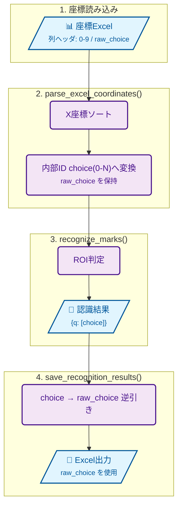

# 開発ガイド

採点侍 (SaitenSamurai) の開発に参加する方向けの技術情報です。

---

## 目次

- [開発環境のセットアップ](#開発環境のセットアップ)
- [リポジトリ構成](#リポジトリ構成)
- [モジュール依存関係](#モジュール依存関係)
- [採点モードのアーキテクチャ](#採点モードのアーキテクチャ)
- [テスト](#テスト)
- [Git 運用ガイド（初心者向け）](#git-運用ガイド初心者向け)
- [コーディング規約](#コーディング規約)
- [コミット禁止物](#コミット禁止物)
- [exe ビルド](#exe-ビルド)

---

## 開発環境のセットアップ

```bash
git clone https://github.com/phys-ken/SaitenSamurai.git
cd SaitenSamurai
pip install -r requirements.txt
```

### 型チェック

`pyrightconfig.json` で `main_src/` がインポートパスに設定されています。
Pylance / Pyright を使用する場合、追加設定は不要です。

```json
{
    "extraPaths": ["main_src"],
    "typeCheckingMode": "basic"
}
```

`basic` モードで型チェックを実施しています。error は 0 件を維持してください。
warning は段階的に解消中です。

### 起動確認

```bash
python main_src/saitensamurai.py
```

起動するとモード選択ダイアログが表示されます。
3 つの採点モード（マーク採点 / マーク＋記述 / 記述採点）から選択できます。

---

## リポジトリ構成

```
├── main_src/                    # アプリケーション本体（16 モジュール）
│   ├── saitensamurai.py         # エントリポイント
│   ├── constants.py             # 共通定数・ユーティリティ
│   ├── omr_engine.py            # OMR 認識エンジン
│   ├── threshold_calibrator.py  # 閾値自動推定
│   ├── scoring_engine.py        # 採点コアロジック
│   ├── image_renderer.py        # 採点結果の画像描画
│   ├── mark_checker.py          # エラー検出・修正補助
│   ├── descriptive_scorer.py    # 記述式採点コアロジック
│   ├── descriptive_gui.py       # 記述式採点 GUI
│   ├── descriptive_renderer.py  # 記述式採点描画
│   ├── name_trimmer.py          # 氏名トリミング
│   ├── summary_generator.py     # Excel サマリー生成
│   ├── ctt_analyzer.py          # CTT 分析
│   ├── r_export.py              # R 連携エクスポート
│   ├── gui_components.py        # サブウィンドウ GUI
│   └── main_gui.py              # メイン統合 GUI
├── tests/                       # pytest テスト（25 ファイル）
│   ├── conftest.py              # Tk ルート共有・パス設定
│   └── test_*.py
├── resources/                   # アプリリソース
│   ├── icon.ico
│   └── samurai.png
├── .github/workflows/test.yml   # GitHub Actions CI
├── saitensamurai.spec           # PyInstaller 設定
├── build_exe.bat                # exe ビルドスクリプト
├── requirements.txt             # 依存パッケージ定義
├── pyrightconfig.json           # 型チェック設定（basic モード）
├── LICENSE                      # GPL-3.0
└── THIRDPARTYLICENSES.md        # サードパーティライセンス
```

---

## モジュール依存関係

`constants.py` が全モジュールの基盤で、循環 import を防止しています。

```
constants.py              ← 他モジュールに依存しない基盤
scoring_engine.py         ← (pandas のみ、他モジュール非依存)
    ↑
omr_engine.py             ← constants
threshold_calibrator.py   ← constants, omr_engine
mark_checker.py           ← constants, omr_engine
name_trimmer.py           ← constants
r_export.py               ← constants            [lazy: ctt_analyzer]
ctt_analyzer.py           ← constants, scoring_engine
image_renderer.py         ← constants, scoring_engine, omr_engine
                                                   [lazy: descriptive_scorer]
descriptive_scorer.py     ← constants, name_trimmer
descriptive_gui.py        ← constants, descriptive_scorer, name_trimmer
descriptive_renderer.py   ← constants, descriptive_scorer
summary_generator.py      ← constants, scoring_engine
                                                   [lazy: ctt_analyzer, r_export]
gui_components.py         ← constants, mark_checker, threshold_calibrator
                                                   [lazy: scoring_engine, omr_engine]
main_gui.py               ← 全モジュール
                                                   [lazy: descriptive_gui, name_trimmer]
saitensamurai.py          ← main_gui（+ 後方互換 re-export）
```

> `[lazy: ...]` はメソッド内で遅延 import されるモジュールを示します。
> 循環 import の回避とオプショナル依存の制御に使用しています。

### 設計原則

- **constants.py** は他の `main_src/` モジュールを import してはならない
- **scoring_engine.py** は純粋ロジックのみ（ファイル I/O や画像処理に依存しない）
- **GUI 依存のない処理**は `*_engine.py` / `*_checker.py` 等に分離
- **遅延 import**: 循環回避やオプション機能の分離のため、多くのモジュールで `[lazy]` パターンを使用

---

## 画像パイプラインのアーキテクチャ

### 処理画像の生成 (`omr_engine.py`)

`process_box_drawer()` は各画像に対して以下の2種類の画像を生成します:

| フォルダ | 定数 | 内容 |
|---|---|---|
| `00_Processing/` | `BOXED_FOLDER` | マーク認識枠を描画した画像（マークチェック用） |
| `00_Processing_Clean/` | `CLEAN_FOLDER` | 射影変換のみ適用したクリーン画像（記述式採点プレビュー用） |

> **並列処理制約**: `_process_single_image()` は `ProcessPoolExecutor` で並列実行されます。
> 引数タプルのアンパック順序（現行 8 要素）を変更する場合、全ワーカーに影響するため注意してください。
> （後方互換のため 7 要素入力も受理する実装です）

### マークチェック正答オーバーレイ (`gui_components.py`)

`MarkCheckerGUI` は正答枠（赤色点線）をプレビュー画像に描画します。

**問題番号のオフセット**:

| 用途 | 問題番号 | 説明 |
|---|---|---|
| テンプレート参照 | `question_no` | skip 後の採点用番号（1始まり） |
| coordinates.csv 参照 | `question_no + skip_questions` | 元の問題番号（skip 込み） |

### OMR 値変換パイプライン

座標 Excel の列ヘッダ値 (`raw_choice`) をそのまま表示値として使用します。



### 描画位置の設計

○×マークのデフォルト描画位置は `question_coords[num_choices - 2]`（後ろから 2 番目の選択肢）です。
`rendering_settings['mark_result_offset']` でセル幅単位のオフセット調整が可能です。

---

## 採点モードのアーキテクチャ

起動時にモード選択ダイアログ (`StartupModeDialog`) を表示し、
選ばれたモードに応じて `SaitenSamuraiGUI` の UI を切り替えます。

### モード定数（`constants.py`）

```python
MODE_MARK_ONLY = "mark_only"
MODE_MARK_AND_DESCRIPTIVE = "mark_and_descriptive"
MODE_DESCRIPTIVE_ONLY = "descriptive_only"
```

### 起動フロー（`saitensamurai.py`）

```
main() → StartupModeDialog(root) → mode, session_path を取得
       → SaitenSamuraiGUI(root, mode=mode, restore_session_path=session_path)
```

### モードごとの UI 差分

| UI 要素 | マーク採点 | マーク＋記述 | 記述採点 |
|---|:---:|:---:|:---:|
| 座標ファイル選択 | ○ | ○ | — |
| Skip 数設定 | ○ | ○ | — |
| OMR スライダー | ○ | ○ | — |
| 認識実行ボタン | ○ 認識実行 | ○ 認識実行 | ○ 画像準備 |
| 正答/OMR 結果選択 | ○ | ○ | — |
| 記述問題設定 | — | ○ | ○ |
| マークチェック | ○ | ○ | — |
| 記述採点ボタン | — | ○ | ○ |
| 記述採点の確認 | — | ○ | ○ |
| 描画詳細設定 (マーク) | ○ | ○ | — |
| 描画詳細設定 (記述) | — | ○ | ○ |

新しいモード固有 UI を追加する場合は `main_gui.py` 内で `self.app_mode` を参照して分岐してください。

### 記述採点のモード固定

記述採点は **問題一覧画面** でモードを選択してから開始します（`_scoring_mode_var`）。
前回選択したモードは `descriptive_config.json` に保存され、次回起動時に自動復元されます。
採点中はモード切替を表示せず、選択したモードで固定されます。
モードを変更したい場合は、採点を中断（自動保存）して問題一覧に戻り、再度選択してください。

---

## テスト

### テストの実行

```bash
# 標準的なテスト実行（推奨）
python -m pytest tests/ -q --timeout=60 -p no:warnings

# 特定のテストファイルのみ
python -m pytest tests/test_scoring_e2e.py -v --timeout=60

# 視覚回帰（実ウィンドウキャプチャ）を含める
python -m pytest tests/ -m "visual" -v --timeout=120

# 全テスト（通常 + visual）
python -m pytest tests/ -m "not legacy_mock" -v --timeout=120

# カバレッジ付き
python -m pytest tests/ -q --timeout=60 -p no:warnings --cov=main_src --cov-report=term-missing
```

> `--timeout=60` を必ず付けてください。GUI テストがハングした場合にタイムアウトで失敗させます。
> テスト実行には `pytest-timeout` が必要です（`pip install pytest-timeout`）。

### マーカー方針（v4.5 テスト再編）

- `visual`: スクリーンショット/視覚回帰テスト（通常実行から除外）
- `gui_heavy`: 実ウィンドウを多く開く重量GUIテスト
- `legacy_mock`: 手組みモックUIを含む移行中テスト

通常の開発サイクルでは `visual` / `legacy_mock` を除外した高速回帰を回し、
リリース前またはUI変更時に `visual` を明示実行してください。

### テスト共通設定 (`conftest.py`)

- `main_src/` をインポートパスに追加
- セッション全体で 1 つの Tk ルートウィンドウを共有
  - 各テストが `tk.Tk()` / `root.destroy()` を個別に行うと Tcl インタプリタが壊れるため
- `pytest_sessionfinish` で Tk ルートを安全に破棄

---

## Git 運用ガイド（初心者向け）

この章は、Git に不慣れな開発者が安全に運用できるようにするための最小ルールです。
アプリ本体の実装ルールとは独立しているため、引き継ぎ時の共通手順として利用できます。

### ブランチ方針

| ブランチ | 用途 | 誰が更新するか |
|---|---|---|
| `main` | アプリ本体・ドキュメント・ワークフロー定義 | 開発者 |
| `stats-data` | リリースDL集計 (`downloads.csv`) の機械生成履歴 | GitHub Actions |

`stats-data` を分離することで、`main` に日次の自動コミットが混ざらず、履歴ノイズと pull 競合を減らせます。

### 普段使う最小コマンド

```bash
# 1) 取り込み（merge commit を作らない）
git pull --rebase

# 2) 状態確認
git status -sb

# 3) 変更を記録
git add -A
git commit -m "feat: 変更内容"

# 4) 反映
git push
```

### 初回に入れておく推奨設定

```bash
git config --global pull.rebase true
git config --global rebase.autoStash true
git config --global pull.ff only
```

上記により、`git pull` 時の不要な merge commit を予防できます。

### 自動DL集計の流れ（main を汚さない）

1. Actions が GitHub API からダウンロード数を取得
2. `downloads.csv` を更新
3. 更新結果を `stats-data` ブランチへ push

`main` への自動書き込みは行いません。

### 公開してよい情報 / だめな情報

Git の運用手順そのものは個人情報ではないため、開発者向けドキュメントに記載して問題ありません。
ただし、以下は公開しないでください。

| 種別 | 例 |
|---|---|
| 秘密情報 | トークン、APIキー、パスワード |
| 個人情報 | 生徒名簿、個票データ、メールアドレス一覧 |
| 環境固有情報 | 個人PCの絶対パス、組織内サーバー名 |

### トラブル時の復旧（最小）

```bash
# 作業中変更を退避
git stash -u

# main を最新へ
git checkout main
git pull --rebase

# 退避を戻す
git stash pop
```

競合が出た場合は、慌てて push せず `git status` で競合ファイルを確認してから解決してください。

---

## コーディング規約

### 全般

- **エンコーディング**: UTF-8（BOM なし）
- **docstring**: モジュール先頭に概要と主な機能を記述
- **ログ出力**: Python 標準 `logging` モジュール経由。各モジュールで `logger = logging.getLogger(__name__)` を定義
- **パス操作**: `pathlib.Path` を推奨、`resource_path()` で PyInstaller 互換を確保

### 命名

- **関数名**: `snake_case`
- **クラス名**: `PascalCase`
- **定数**: `UPPER_SNAKE_CASE`（`constants.py` に集約）

### オプショナル依存

```python
try:
    import fitz
    HAS_PYMUPDF = True
except ImportError:
    fitz = None
    HAS_PYMUPDF = False
```

PyMuPDF, matplotlib, reportlab はオプション扱いです。
未インストール時はフラグで分岐し、該当機能を無効化してください。

---

## コミット禁止物

以下はリポジトリにコミットしないでください（`.gitignore` で除外済み）:

| パターン | 理由 |
|---|---|
| `_saiten_grading_results/` | アプリが生成する採点結果 |
| `_mark2_grading_results/` | 旧フォルダ名（後方互換） |
| `template_coordinates.csv` | 座標パース時のデバッグ CSV |
| `tmp_checking_dm_nm.csv` | Checker 一時ファイル |
| `sample_bigfiles/` | 大容量テストデータ |
| `venv_build/` | exe ビルド用仮想環境 |
| `dist/` | ビルド出力 |
| `build/` | PyInstaller 中間出力 |
| `*.log` | クラッシュログ等 |
| `tests/tmp_output/` | テスト一時出力 |
| `.vscode/` | エディタ設定 |

---

## exe ビルド

### ビルド手順

```bash
build_exe.bat
```

出力: `dist/SaitenSamurai.exe`

### 仕組み

1. `venv_build/` にビルド専用仮想環境を作成
2. requirements.txt + pyinstaller をインストール
3. `saitensamurai.spec` に従って PyInstaller でビルド

### spec ファイルの構成 (`saitensamurai.spec`)

- **エントリポイント**: `main_src/saitensamurai.py`
- **同梱データ**: `resources/icon.ico`, `resources/samurai.png`
- **hiddenimports**: main_src の全モジュール + オプション依存
- **excludes**: 不要なバックエンド (GTK/Qt/Wx)、テスト、開発ツール等
- **バイナリ除外**: AVIF/WebP プラグイン DLL、FFmpeg DLL
- **データ除外**: haarcascade XML、matplotlib サンプルデータ

### 軽量化のポイント

- `opencv-python-headless` を使用（highgui/FFmpeg 不要）
- matplotlib は `backend_agg` と `backend_tkagg` のみ残す
- matplotlib フォントは DejaVuSans のみ残し、AFM・STIX・CM 等を除外
- Pillow の未使用フォーマットプラグインを除外
- 不要な標準ライブラリ (`sqlite3`, `xmlrpc`, `ftplib` 等) を除外
- ネットワーク系パッケージ (`certifi`, `urllib3`, `requests`) を除外

### リリースビルドの依存関係に関する注意（重要）

`.github/workflows/release.yml` の `Install dependencies` ステップに列挙する
パッケージは **`requirements.txt` と手動で同期**させる必要がある。

過去に `scikit-learn` がこのリストから漏れていたことがあり、
`saitensamurai.spec` の `collect_all('sklearn')` が「パッケージが
インストールされていない」ため全て `not found` を返しているにも関わらず
**PyInstaller のビルド自体は正常終了してしまい**、K-means クラスタリング
機能が同梱されない壊れた exe がそのまま GitHub Release として公開される
という事故が起きた（v4.5.1 で発生、v4.5.2 で修正）。

ビルドの exit code だけでは検知できないため、新しい依存を追加した際や
sklearn 関連の不具合を疑うときは、以下の手順で **exe を実際に起動して
確認する**こと。

**1. `main_src/saitensamurai.py` に組み込み済みの自己診断フック**

環境変数 `SAITENSAMURAI_SMOKE_TEST=1` を設定して exe を起動すると、
GUI を開かずに `sklearn.cluster.KMeans` を実際に fit し、結果を
exe と同じフォルダの `smoke_test_result.txt` に書き出して終了する
（`OK` または `FAIL: <例外内容>`）。console=False ビルドのため
標準出力ではなくファイル経由で結果を返す。

**2. release.yml に一時的に追加して使う検証ステップ（v4.5.2 で実際に使用・動作確認済み）**

```powershell
- name: Smoke test (sklearn/joblib bundling)
  run: |
    $exePath = "${{ steps.exe-name.outputs.EXE_PATH }}"
    $resultPath = Join-Path (Split-Path $exePath) "smoke_test_result.txt"
    if (Test-Path $resultPath) { Remove-Item $resultPath -Force }

    $env:SAITENSAMURAI_SMOKE_TEST = "1"
    $proc = Start-Process -FilePath $exePath -PassThru

    $waited = 0
    while (-not (Test-Path $resultPath) -and $waited -lt 60) {
      Start-Sleep -Seconds 1
      $waited++
    }

    if (-not $proc.HasExited) {
      Stop-Process -Id $proc.Id -Force -ErrorAction SilentlyContinue
    }

    if (-not (Test-Path $resultPath)) {
      Write-Error "スモークテスト結果ファイルが生成されませんでした（${waited}秒待機）。exeの起動に失敗した可能性があります。"
      exit 1
    }

    $result = Get-Content $resultPath -Raw
    Write-Host "Smoke test result: $result"
    if ($result -notmatch "^OK") {
      Write-Error "スモークテスト失敗: $result"
      exit 1
    }
```

`Detect exe name` ステップの直後・`Create Release` ステップの直前に挿入する
（失敗時は exit 1 で job が止まり、Release が作成されないようにするため）。
恒久的には release.yml に含めず、疑わしいときだけ一時的に追加して確認し、
確認後は削除する運用とする。

**3. ビルドログでの簡易確認**

exe を起動できない環境では、`Build exe` ステップのログで
`Hidden import 'sklearn...' not found` が出ていないかを grep するだけでも
一次確認になる（ただし exe が実際に動作することの保証にはならない）。
