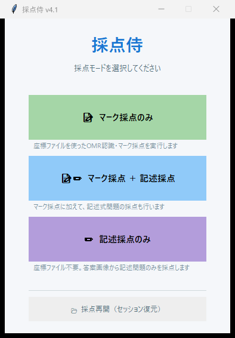

<p align="center">
  
</p>

<h1 align="center">採点侍 — SaitenSamurai</h1>

<p align="center">
  <strong>普通紙マークシート採点 ＆ 記述式採点を、これ1本で。</strong><br>
  教員による教員のための、Windows 向け無料採点支援ソフトウェアです。
</p>

<p align="center">
  <a href="https://github.com/phys-ken/SaitenSamurai/releases/latest">
    
  </a>
  <a href="https://phys-ken.github.io/SaitenSamurai/">
    
  </a>
  <a href="LICENSE">
    
  </a>
</p>

---

## :book: ドキュメント

使い方・ダウンロード方法・FAQ・免責事項など、すべての情報は **ドキュメントサイト** にまとまっています。

### **:point_right: [https://phys-ken.github.io/SaitenSamurai/](https://phys-ken.github.io/SaitenSamurai/)**

| ページ | 内容 |
|---|---|
| [ダウンロード](https://phys-ken.github.io/SaitenSamurai/download/) | exe の入手方法・インストール手順 |
| [クイックスタート](https://phys-ken.github.io/SaitenSamurai/quickstart/) | 5 分で最初の採点を体験 |
| [機能一覧](https://phys-ken.github.io/SaitenSamurai/features/) | すべての機能を一覧で確認 |
| [使い方ガイド](https://phys-ken.github.io/SaitenSamurai/usage/mark/) | 各採点モードの詳細な操作方法 |
| [よくある質問](https://phys-ken.github.io/SaitenSamurai/faq/) | トラブルシューティング |
| [免責事項](https://phys-ken.github.io/SaitenSamurai/disclaimer/) | 利用上の注意 |

---

## 概要

<p align="center">
  
</p>

### 採点斬りからの進化

本ソフトウェアは、開発者 (phys-ken) が 2021 年に公開した **[採点斬り 2021](https://phys-ken.github.io/saitenGiri2021/)** をベースに、UI の改善やコードの整理を行ったうえで大幅な機能強化を施したものです。

採点斬り 2021 は、竹内俊彦氏の「採点革命」や島守睦美氏の「採点斬り」に触発されて開発した、非公式のフリーソフトでした。当初は知人の間で使うだけのつもりでしたが、SNS 等で思いがけず多くの方に利用していただくことになりました。広く使っていただけたのは大変ありがたかったのですが、元の「採点斬り」の名前をそのまま使ってしまったことへの反省がありました。

こうした経緯を踏まえ、公開から時間が経ったことと機能の大幅な改善を機に、ソフト名を **「採点侍」** として改めました。

---

採点侍は、3 つの採点モードであらゆる試験形式に対応します。

| モード | 用途 | 必要なもの |
|---|---|---|
| **マーク採点** | マークシートのみ | スキャン画像 + Mark2 座標ファイル |
| **記述式採点** | 記述式のみ | スキャン画像のみ |
| **マーク＋記述** | 混在する試験 | スキャン画像 + Mark2 座標ファイル |

### 主な特徴

- **OMR 自動読み取り** — コーナーマーカー検出・傾き補正・閾値自動キャリブレーション
- **記述式採点** — マウスで採点領域を設定、○×ボタンや数字キーで効率的に採点
- **グリッド一覧モード** — 全生徒の解答を一覧表示で素早く処理
- **CTT 分析** — α 係数・P 値・D 値・I-T 相関を自動算出、PDF レポート出力
- **Excel 一括出力** — 生徒別成績サマリー・試験統計を自動生成
- **セッション保存** — 作業途中の状態を保存・復元
- **インストール不要** — 単体 exe をダブルクリックで起動

### 動作環境

| 項目 | 要件 |
|---|---|
| **OS** | **Windows 11**（動作確認済み） |
| **exe 版** | インストール不要（単体 exe） |
| **ソースから実行** | Python 3.9 以上 |

---

## クイックスタート

### exe 版（推奨）

1. [Releases ページ](https://github.com/phys-ken/SaitenSamurai/releases/latest) から `SaitenSamurai.exe` をダウンロード
2. 任意のフォルダに配置してダブルクリック
3. モード選択画面で採点モードを選んで開始

### ソースから実行

```bash
git clone https://github.com/phys-ken/SaitenSamurai.git
cd SaitenSamurai
pip install -r requirements.txt
python main_src/saitensamurai.py
```

---

## 開発者向け

開発環境のセットアップ、モジュール構成、テストの実行方法については [DEVELOPMENT.md](DEVELOPMENT.md) を参照してください。

### exe のビルド

```bash
build_exe.bat
```

出力先: `dist/SaitenSamurai.exe`

---

## ライセンス

**GPL-3.0** — 詳細は [LICENSE](LICENSE) を参照してください。

サードパーティライブラリのライセンスは [THIRDPARTYLICENSES.md](THIRDPARTYLICENSES.md) に記載しています。

---

## クレジット

- **[Mark2](https://github.com/Mark2OSS/Mark2)** — 慶應義塾大学 SFC 研究所（MIT License）— 座標系・OMR 基盤
- **[採点斬り 2021](https://phys-ken.github.io/saitenGiri2021/)** — phys-ken（GPL-3.0）— 記述式採点の設計参考
- **採点斬り** — 島守睦美 氏 — デジタル採点のコンセプトの元祖
- **採点革命** — 竹内俊彦 氏 — デジタル採点の草分け
- **[デジタル採点 All in One](https://coding-tips-memoranda.com/%E3%83%87%E3%82%B8%E3%82%BF%E3%83%AB%E6%8E%A1%E7%82%B9-all-in-one/)** — 模範解答表示方法の参考

---

<p align="center">
  <sub>作者: <a href="https://phys-ken.github.io/phys-ken/">phys-ken</a></sub>
</p>
