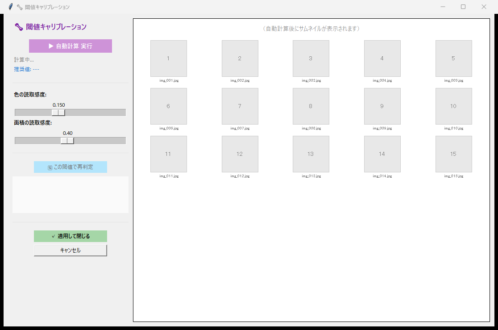
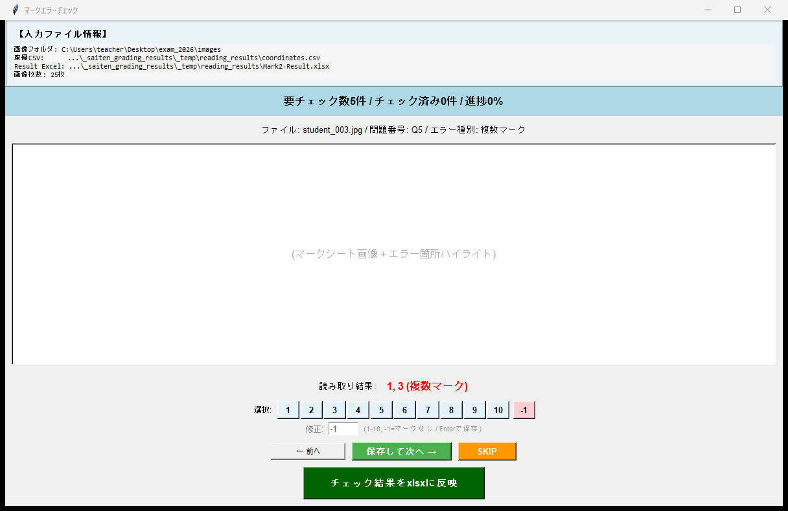
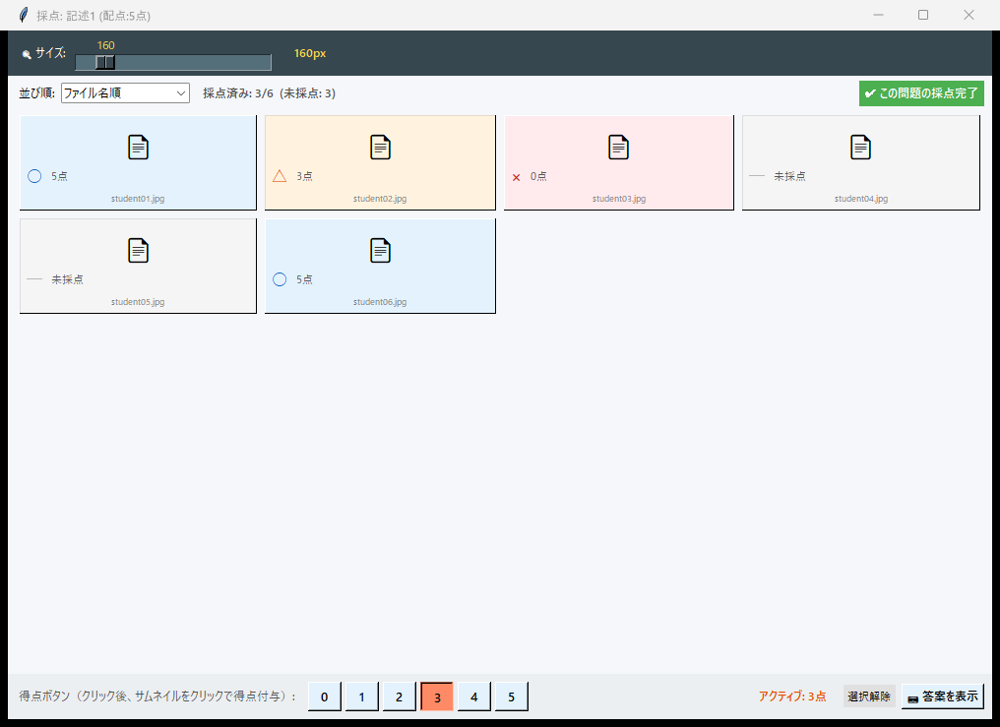
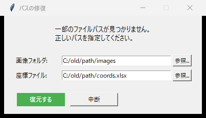

# 機能一覧

採点侍が搭載する機能の一覧です。

---

## 採点モード

### :material-checkbox-marked-outline: マーク採点

Mark2 座標ファイルに基づき、OMR（光学マーク認識）でマークシートを自動読み取り・自動採点します。

### :material-text-box-edit-outline: 記述式採点

スキャン画像上でマウスドラッグにより採点領域を設定。○×ボタンや数字キーで、記述式答案を採点します。

### :material-clipboard-check-outline: マーク＋記述 混合

マーク式と記述式が混在する試験を、1つのワークフローで統合処理。合計点も自動で合算します。

---

## OMR（光学マーク認識）

| 機能 | 説明 |
|---|---|
| **コーナーマーカー検出** | 射影変換による自動傾き補正 |
| **二値化 + 面積比率** | マーク有無を黒い面積の比率で判定 |
| **閾値キャリブレーション** | K-means クラスタリング + 大津の二値化法で閾値を自動最適化 |
| **手動微調整** | 自動推定が合わない場合、GUI で閾値を手動修正 |

{ .screenshot }
閾値キャリブレーション — 自動推定 + 手動微調整

---

## マークチェック

| 機能 | 説明 |
|---|---|
| **未マーク検出** | どの選択肢もマークされていない答案を自動検出 |
| **ダブルマーク検出** | 複数の選択肢がマークされた答案を自動検出 |
| **GUI 修正** | 検出されたエラーを 1 件ずつ確認し、画面上で修正 |

{ .screenshot }
マークチェック — エラーの確認と修正

---

## 記述式採点

| 機能 | 説明 |
|---|---|
| **領域設定** | マウスドラッグで問題ごとの採点領域を指定 |
| **○× 判定 + 部分点** | ○×ボタン・ショートカットキー・数字キーで得点を入力 |
| **背景色フィードバック** | 判定に応じて背景色が変化する視覚的フィードバック |
| **1枚ずつ / 一覧グリッド** | 用途に応じて切り替えられる 2 つの採点表示モード |
| **未採点フィルタ** | 1枚ずつモードで、未採点の答案のみ表示して採点漏れを防止 |

{ .screenshot-wide }
グリッド一覧モード — 全生徒の解答を俯瞰しながら採点

---

## 出力・レポート

| 機能 | 説明 |
|---|---|
| **採点済み答案画像** | ○×△マーク・得点を答案画像に描画して出力 |
| **生徒別サマリー Excel** | 各生徒の問題別得点を一覧にしたExcel |
| **試験統計 Excel** | 全体の平均点・標準偏差・得点分布 |
| **CTT 分析 PDF** | α係数, P値(正答率), D値(識別力), I-T相関を算出しPDF化 |
| **R エクスポート** | exametrika 用の R データ形式でエクスポート |

---

## システム機能

| 機能 | 説明 |
|---|---|
| **PDF 入出力** | PDF 形式のスキャン画像に対応（PyMuPDF 使用） |
| **セッション保存・復元** | 作業途中の状態を JSON で保存し、後から再開 |
| **パス修復** | PC やフォルダを変更しても、パス修復ダイアログで復帰 |
| **氏名トリミング** | 名簿画像の氏名領域を自動トリミング |
| **クラッシュログ** | 未処理例外をログファイルに記録し、原因調査を支援 |
| **描画設定カスタマイズ** | ○×マーク、得点テキスト、合計点の表示を細かく調整 |

{ .screenshot-small }
パス修復ダイアログ — フォルダ移動後の復旧
