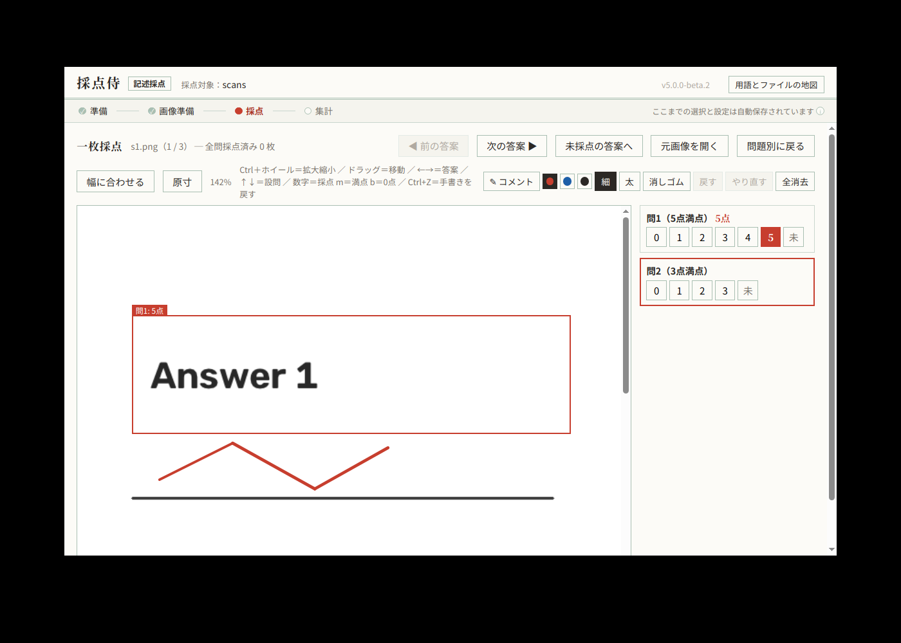
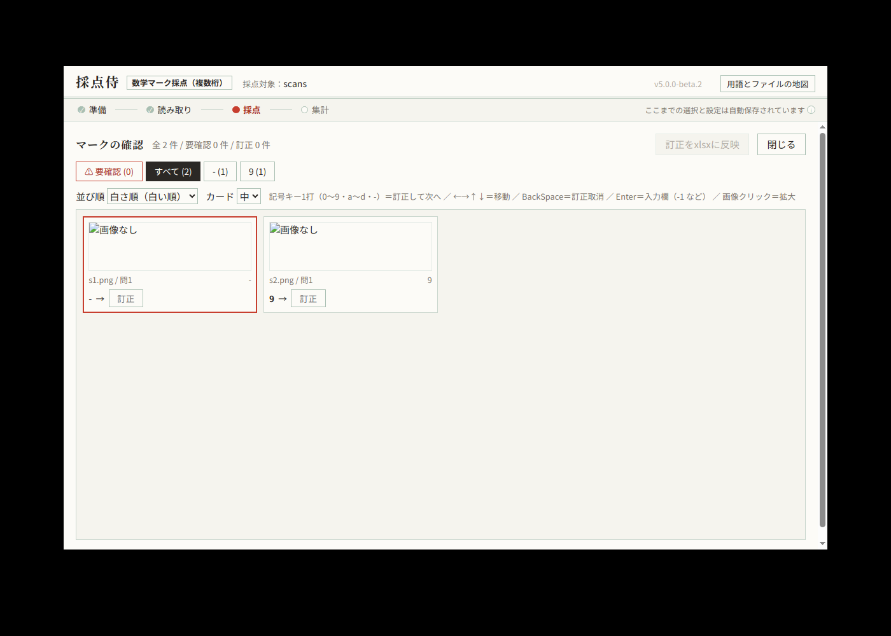
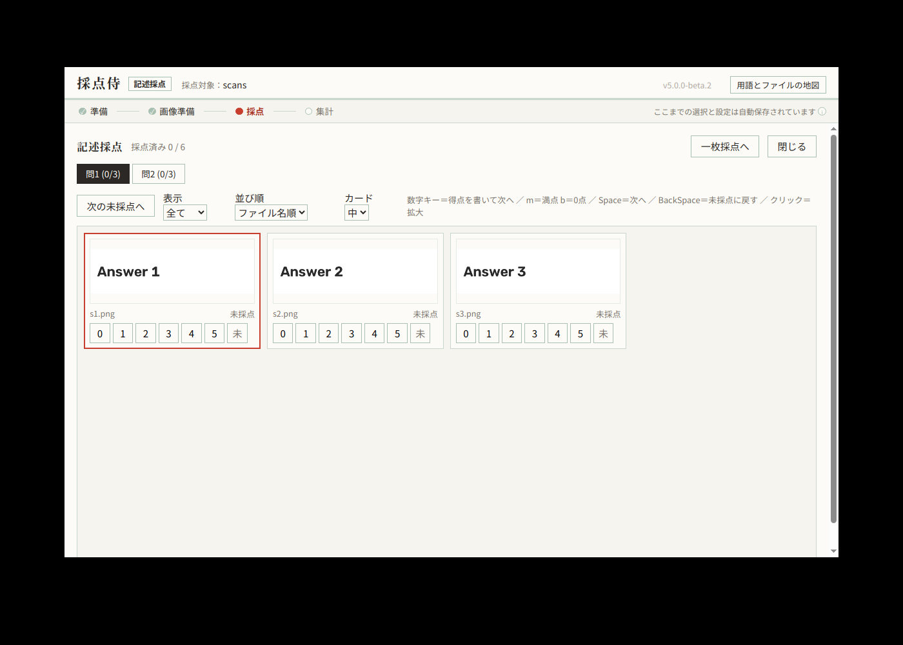
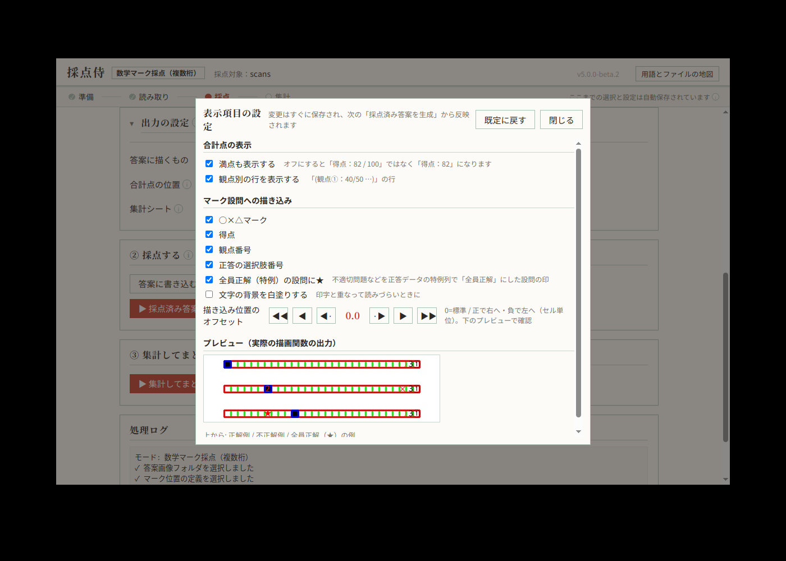

# 機能一覧

採点侍が搭載する機能の一覧です。

---

## 新UI（v5 系ベータ）

v5.0.0 ベータでは、GUI を pywebview ベースの**新UI**に刷新しました。
従来UI（v4 系）と採点データは完全に共通で、途中でどちらへ移っても続きから採点できます。

| 機能 | 説明 |
|---|---|
| **進行バーの常設** | 画面上部に「準備 → 読み取り → 採点 → 集計」を常時表示。いまどこまで進んだかが一目で分かります |
| **キーボード採点と自動送り** | マークの確認は記号キー 1 打で「訂正して次へ」、記述採点は数字キーで「得点を書いて次へ」。手をマウスに戻さず流れるように採点できます |
| **仮想スクロール** | マークの確認・記述採点の一覧は仮想スクロールで描画。400 人 × 100 問の規模でも 1 本のスクロールで軽快に動きます |
| **手書きコメント** | 答案ごとの確認・修正ビューや1枚ずつ採点の画面で、マウスやペンタブレットから答案に書き込み。◎ ○ ✓ 波線のワンクリックスタンプ付き。ベクターデータとして保存し、採点済み答案の生成時に高解像度で焼き込みます。**元画像には一切書き込みません**（何度でも編集可） |
| **自由ズーム** | 1枚ずつ・答案ごとの確認は Ctrl＋ホイールで自由に拡大縮小。細かい字も読みながら採点できます |
| **出力の設定の集約とライブプレビュー** | 描き込み内容・合計点の位置・集計シートの設定を「出力の設定」に集約。「表示項目の設定」では実際の描画関数の出力をライブプレビューしながら調整できます |
| **ℹ 補足説明と「用語とファイルの地図」** | 各項目の ℹ でその場の説明を表示。右上の「用語とファイルの地図」に、生成されるフォルダ・ファイルの役割と「消してよいか」の一覧があります |

{ .screenshot }
新UIのメイン画面 — 上部の進行バーが現在地を示します

{ .screenshot }
答案ごとの確認・修正 — ペン/マウスで答案に手書きコメントを書き込めます

---

## 採点モード

起動時のモード選択画面から、試験の内容に合ったモードを選びます。

### :material-checkbox-marked-outline: マーク採点のみ

マーク位置の定義ファイル（Mark2 座標 Excel）を使って答案を読み取り、OMR（光学マーク認識）で自動採点します。

### :material-text-box-edit-outline: 記述採点のみ

マーク位置の定義は不要。スキャン画像上でマウスドラッグにより採点領域を設定し、数字キーやクリックで記述式答案を採点します。

### :material-clipboard-check-outline: マーク採点 ＋ 記述採点

マーク式と記述式が混在する試験を、1つのワークフローで統合処理。合計点も自動で合算します。

### :material-calculator-variant-outline: 数学マーク採点のみ ／ ＋ 記述採点（β）

共通テスト数学のような**連鎖配点（複数桁設問）**に対応。複数のマーク行で1つの値（`-24` など）を構成し、全行正解のときのみ得点する「完答」方式で採点します。記述式との併用モードもあります。

!!! warning "数学マーク採点はβ版です"
    仕様が変わる可能性があります。成績処理に使用する場合は、必ず採点結果をご自身の目で確認してください。
    不具合は [Issues](https://github.com/phys-ken/SaitenSamurai/issues) へお知らせください。

### 数学マーク採点（β）の概要

- **紙面**: 各解答番号の行に `-, 0〜9, a, b, c, d` の15マークを持つ専用テンプレートを使用します（モード選択で「数学マーク採点のみ」または「数学マーク採点 ＋ 記述採点」を選択）
- **正答データの書き方**: 問題番号列に範囲表記「1-3」＋正答「-24」で3行を1問として採点。単独行に複数文字の正答（例: 問題番号「5」に「15」）を書けば、**正答の文字数ぶん自動で行を割り付け**るので範囲の手計算は不要です
- **採点ルール**: グループ全行の完全一致で満点、それ以外は0点（完答）。無マーク・ダブルマークが1行でもあれば不正解
- **正答チェック**: 正答データの選択時に登録内容を自動検証し、行割当・満点・警告を含む**チェック報告**と配布用の**模範解答**（いずれもMarkdown）を書き出します
- **集計・分析**: 得点一覧・CTT分析・R連携も1問=1項目（例:「問1-3」）として集計されます

---

## OMR（光学マーク認識）

| 機能 | 説明 |
|---|---|
| **コーナーマーカー検出** | 射影変換による自動傾き補正 |
| **二値化 + 面積比率** | マーク有無を黒い面積の比率で判定 |
| **K-means 認識** | 7次元特徴量（ローカル5 + コンテキスト2）で「マーク済み / 空白」を自動分類。読み取り方式「（推奨）クラスタリング」として既定 |
| **しきい値方式 + 自動調整** | 「しきい値による識別（従来式）」では濃さ・面積を数値で直接指定。「自動調整」ボタンがK-means クラスタリング + 大津の二値化法で推奨値を推定・適用 |
| **手動微調整（従来UIのみ）** | 従来UIのキャリブレーション画面（ギャラリー表示・再判定・答案ビューア）。新UIでは「マークを確認する」の白さ順一覧が確認の役割を担います |

---

## マークの確認（マークチェック）

| 機能 | 説明 |
|---|---|
| **ノーマーク検出** | どの選択肢もマークされていない答案を自動検出 |
| **複数マーク検出** | 複数の選択肢がマークされた答案を自動検出 |
| **キー1打の訂正** | 記号キー（`0`〜`9`・`a`〜`d`・`-`）1打で訂正して次のカードへ。`BackSpace` で取消、`Enter` で入力欄（`-1` など） |
| **タブ切り替え** | 「⚠ 要確認」「すべて」に加え、読み取った**値ごとのタブ**で横並びに見比べ |
| **白さ順ソート** | OMR時に生成した白さキャッシュを使い、マークが薄い（読み取りに自信がない）順に表示（既定）。従来UIの「薄い解答 / 濃い解答」タブはこのソートに置き換え |
| **仮想スクロール** | 数千件の一覧を 1 本のスクロールで表示（従来UIは 100 件ごとのページ切り替え） |
| **一括訂正** | 「ノーマーク全件を無効回答(-1)にする」でまとめて処理 |
| **安全な反映** | 「訂正をxlsxに反映」の前に自動バックアップを作成。未反映のまま閉じるときは確認 |
| **正答枠表示（従来UIのみ）** | 正答の選択肢位置に赤色の点線枠を表示 |

{ .screenshot }
マークの確認 — 要確認のマークをカード一覧で訂正

---

## 記述式採点

| 機能 | 説明 |
|---|---|
| **領域設定** | マウスドラッグで問題ごとの採点領域を指定 |
| **キーボード採点** | 数字キー＝得点を書いて次へ、`m`＝満点、`b`＝0点、`Space`＝次へ、`BackSpace`＝未採点に戻す。2桁の得点にも対応 |
| **一覧 / 1枚ずつ** | 全生徒を俯瞰する一覧グリッドと、1 枚ずつ大きく表示して採点する表示をワンクリックで切り替え |
| **表示フィルタ** | 「全て / 未採点 / 満点 / 0点 / 中間点」の 5 種で絞り込み、採点漏れや配点ミスを確認 |
| **並び順・カードサイズ** | ファイル名順 / 得点昇順・降順、カードは小・中・大 |
| **ズームとパン** | 1枚ずつ・答案ごとの確認は Ctrl＋ホイールで自由ズーム |
| **手書きコメント** | 「答案ごとの確認・修正」と「1枚ずつ」で答案にペン/マウスで書き込み。◎ ○ ✓ 波線のスタンプも（マークのみモードでも利用可） |

{ .screenshot-wide }
記述採点のグリッド表示 — 全生徒の解答を俯瞰しながらキーボードで連続採点

---

## 出力・レポート

| 機能 | 説明 |
|---|---|
| **採点済み答案画像** | ○×△マーク・得点・合計点を答案画像に描画して出力（手書きコメントも焼き込み） |
| **生徒別サマリー Excel** | 各生徒の問題別得点を一覧にしたExcel（氏名欄の画像貼り付けにも対応） |
| **試験統計 Excel** | 全体の平均点・標準偏差・得点分布 |
| **CTT 分析 PDF** | α係数, P値(正答率), D値(識別力), I-T相関を算出しPDF化 |
| **R エクスポート** | exametrika 用の R データ形式でエクスポート |

---

## システム機能

| 機能 | 説明 |
|---|---|
| **PDF 入出力** | PDF 形式のスキャン画像に対応（PyMuPDF 使用） |
| **セッション保存・復元** | 作業途中の状態を自動保存し、後から再開。新UIは操作のたびに自動保存し、フォルダを選び直すと再開を提案 |
| **壊れたパスの検出** | フォルダ移動後などの壊れたパスは警告としてログに表示し、通常の選択ボタンで選び直して復帰（従来UIは専用のパス修復ダイアログ） |
| **氏名トリミング** | 答案画像の氏名領域を切り出して集計シートに表示 |
| **クラッシュログ** | 未処理例外をログファイルに記録し、原因調査を支援 |
| **出力の設定 / 表示項目の設定** | ○×マーク・得点・合計点などの描き込み内容と位置を、ライブプレビューを見ながら調整 |

{ .screenshot }
表示項目の設定 — 実際の描画関数の出力をプレビューしながら調整
