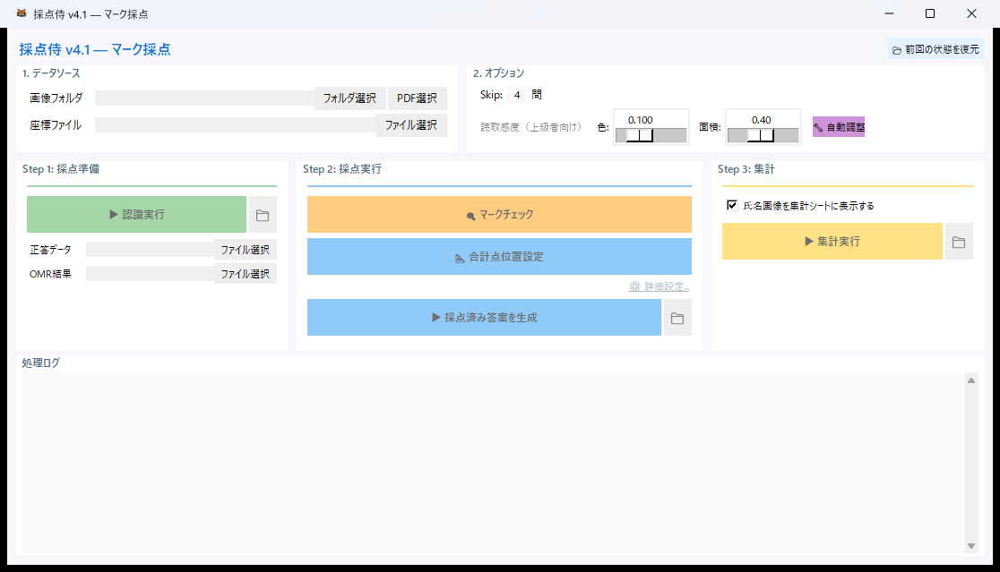
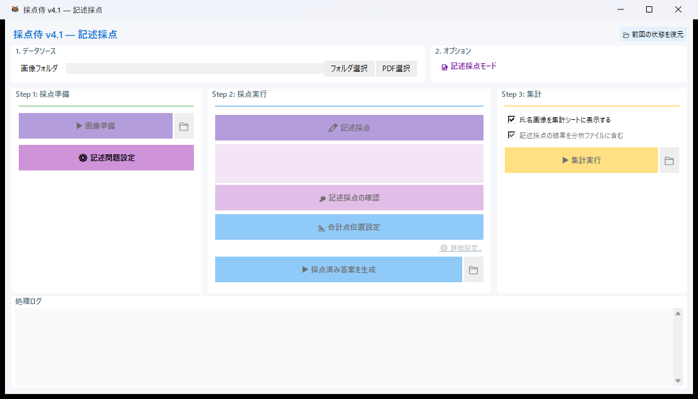

# クイックスタート

最初の採点を **5 分** で体験するためのガイドです。  
パソコンが苦手な方でも、このページに沿って進めれば大丈夫です。

---

## 事前準備

採点を始める前に、次の素材を用意してください。

| 必要なもの | 説明 |
|---|---|
| **スキャン画像** | 答案用紙をスキャンした JPEG / PNG / PDF。**1 枚の画像 = 1 人分の答案** です |
| **Mark2 座標ファイル**（マーク採点時のみ） | [Mark2 テンプレートサイト](https://mark2.sfc.keio.ac.jp/ja/templates) からダウンロードした座標 Excel ファイル |

!!! tip "まずはサンプルで試す"
    リポジトリの `sample_basefile/` フォルダに、すぐ試せるサンプルファイルが入っています。  
    初めての方は、まずサンプルで一通りの流れを確認してみてください。

!!! info "解答用紙の作り方"
    テスト用紙の自作やカスタマイズ方法は **[解答用紙の準備](preparation.md)** をご覧ください。

---

## Step 1: 起動してモードを選ぶ

1. `SaitenSamurai.exe` をダブルクリックして起動します
2. モード選択ダイアログが表示されるので、試験の内容に合ったモードを選んでください

{ .screenshot-small }
<span class="caption">起動時のモード選択画面</span>

| モード | こんなときに |
|---|---|
| **マーク採点** | マークシートのみの試験 |
| **記述式採点** | 記述式のみの試験（座標ファイル不要） |
| **マーク＋記述** | マーク式と記述式が混在する試験 |

!!! info "Windows SmartScreen の警告が出たら"
    初回起動時に「WindowsによってPCが保護されました」という青い画面が出ることがあります。  
    **「詳細情報」** をクリック → **「実行」** をクリック すると起動できます。個人開発のフリーソフトでは正常な動作です。

!!! info "前回の続きから再開したい場合"
    モード選択画面の下にある **「📂 採点再開（セッション復元）」** ボタンをクリックすると、  
    前回保存したセッションファイル（`session_state.json`）を選んで、前回の続きから作業を再開できます。  
    詳しくは [セッション保存と復元](faq.md#session-save-restore) をご覧ください。

---

## Step 2: ファイルを読み込む

モードを選択すると、メイン画面が表示されます。  
画面上のボタンを **上から順に** 操作してください。

=== "マーク採点"

    1. **「フォルダ選択」** ボタンを押して、スキャン画像が保存されているフォルダを指定します  
       （PDF ファイルの場合は **「PDF 選択」** を使います）
    2. **「ファイル選択」** ボタンを押して、Mark2 の座標ファイル（Excel）を選択します
    3. **Skip 数**を確認します — 解答欄の前にある「学年」「クラス」「番号」等の欄の数です（多くのテンプレートでは `4` のまま）
    4. **「▶ 認識実行」** ボタンを押します — マーク認識が開始され、完了すると正答データファイル（`answer_key.xlsx`）が自動生成されます

    { .screenshot }
    <span class="caption">マーク採点モードのメイン画面</span>

=== "記述式採点"

    1. **「フォルダ選択」** ボタンを押して、スキャン画像が保存されているフォルダを指定します
    2. **「▶ 画像準備」** ボタンを押します
    3. **「⚙ 記述問題設定」** ボタンを押して、答案画像上でマウスドラッグして採点領域を設定します

    { .screenshot }
    <span class="caption">記述式採点モードのメイン画面</span>

=== "マーク＋記述"

    1. **「フォルダ選択」** → **「ファイル選択」** の順にスキャン画像と座標ファイルを指定します
    2. **「▶ 認識実行」** でマーク認識を実行します
    3. **「⚙ 記述問題設定」** で記述式の採点領域を追加設定します

    { .screenshot }
    <span class="caption">マーク＋記述モードのメイン画面</span>

---

## Step 3: 正答を入力する（マーク採点の場合）

OMR 認識を実行すると、スキャン画像フォルダの中に `_saiten_grading_results/` フォルダが自動的に作成されます。  
その中の `01_Results/results_data/answer_key.xlsx` を Excel で開いて、正答・配点・観点を記入してください。

```
スキャン画像フォルダ/
└── _saiten_grading_results/
    └── 01_Results/
        └── results_data/
            └── answer_key.xlsx  ← ★ このファイルを編集
```

| 列名 | 入力内容 | 例 |
|---|---|---|
| **問題番号** | 自動入力済み | 1, 2, 3 … |
| **正答** | 正しい選択肢の番号 | `2` |
| **配点** | その問題の得点 | `3` |
| **観点** | 観点別集計のグループ番号 | `1` |

記入が終わったら保存して閉じ、メイン画面の「正答データ」の **「ファイル選択」** から `answer_key.xlsx` を選択してください。

!!! tip "観点とは？"
    観点別集計を行うためのグループ番号です（例: 知識=1, 思考=2）。**不要であれば全て `1` のまま** で構いません。

---

## Step 4: 採点して結果を出力する

=== "マーク採点"

    1. **「🔍 マークチェック」** — OMR が自動検出したエラー（未マーク・ダブルマーク）を 1 件ずつ確認・修正します（推奨）
    2. **「📐 合計点位置設定」** — 答案上に合計点を印字する場所を指定します
    3. **「▶ 採点済み答案を生成」** — ○×と得点が描画された画像を出力します
    4. **「▶ 集計実行」** — 生徒別成績サマリーや試験統計を Excel に出力します

=== "記述式採点"

    1. **「✏ 記述採点」** — 問題ごとに採点画面が開き、○×ボタンや数字キーで得点を入力します
    2. **「📐 合計点位置設定」** → **「▶ 採点済み答案を生成」** で結果画像を出力します
    3. **「▶ 集計実行」** で集計します

=== "マーク＋記述"

    1. **「🔍 マークチェック」** でマーク側のエラーを確認・修正
    2. **「✏ 記述採点」** で記述問題を採点
    3. **「▶ 採点済み答案を生成」** → **「▶ 集計実行」** でマークと記述の点数が合算された結果を出力

---

## 出力ファイルの場所

すべての出力ファイルは、**スキャン画像フォルダの中** に自動生成される `_saiten_grading_results/` フォルダに保存されます。

```
あなたのスキャン画像フォルダ/
├── 生徒01.jpg
├── 生徒02.jpg
├── …
└── _saiten_grading_results/       ← ★ ここに出力されます
    ├── 00_Processing/             ← 枠描画済み画像（中間ファイル）
    ├── 00_Processing_Clean/       ← 補正済み画像（枠なし）
    ├── 01_Results/                ← OMR データ・正答ファイル
    │   └── answer_key.xlsx        ← 正答データ
    ├── 02_Graded_Detail/          ← 採点済み答案画像（○×マーク付き）
    └── 03_Final_Report/           ← 成績サマリー・統計レポート・CTT分析
```

描画設定をカスタマイズして、○×マークや点数の表示位置を調整することもできます。

{ .screenshot }
<span class="caption">描画設定のカスタマイズ</span>

---

## 次のステップ

各モードの詳しい操作方法は、以下のページをご覧ください。

- **[マーク採点の使い方](usage/mark.md)** — OMR 読み取り、マーク読み取り精度の設定、マークチェック、描画設定
- **[記述式採点の使い方](usage/descriptive.md)** — 領域設定、○×△採点、グリッド一覧モード
- **[マーク＋記述の使い方](usage/combined.md)** — 混合試験のワークフロー
