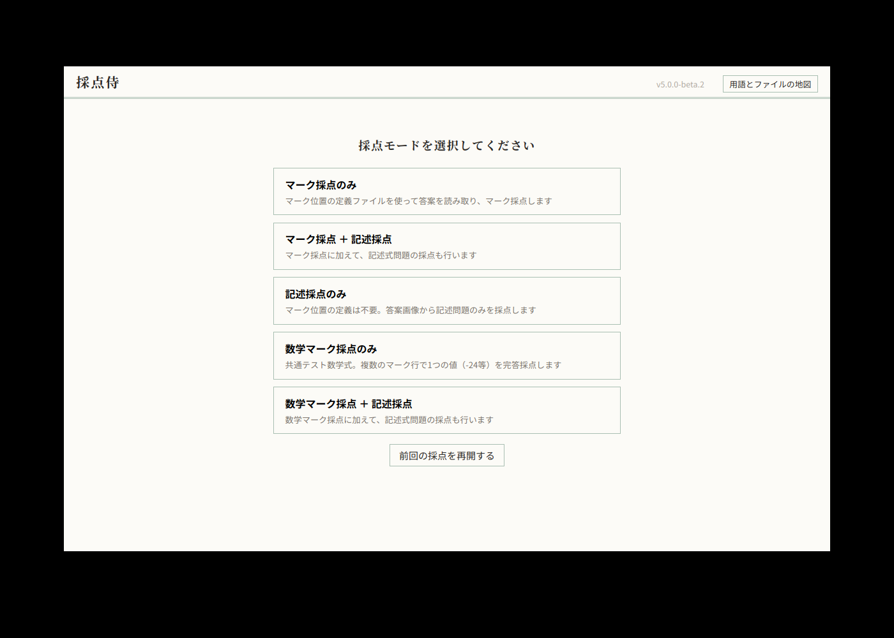
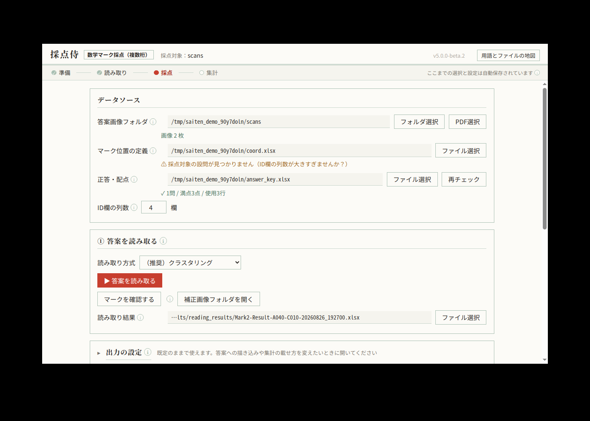

# クイックスタート

最初の採点を **5 分** で体験するためのガイドです。
パソコンが苦手な方でも、このページに沿って進めれば大丈夫です。

このページは **新UI（v5 系ベータ）** の画面で説明します。
従来UI（v4 系）をお使いの場合は、各所の「従来UI」タブをご覧ください。

---

## 事前準備

採点を始める前に、次の素材を用意してください。

| 必要なもの | 説明 |
|---|---|
| **スキャン画像** | 答案用紙をスキャンした JPEG / PNG / PDF。**1 枚の画像 = 1 人分の答案** です |
| **マーク位置の定義**（マーク採点時のみ） | [Mark2 テンプレートサイト](https://mark2.sfc.keio.ac.jp/ja/templates) からダウンロードした座標 Excel ファイル（いわゆる「座標ファイル」） |

!!! tip "まずはサンプルで試す"
    リポジトリの `sample_basefile/` フォルダに、すぐ試せるサンプルファイルが入っています。
    初めての方は、まずサンプルで一通りの流れを確認してみてください。

!!! info "解答用紙の作り方"
    テスト用紙の自作やカスタマイズ方法は **[解答用紙の準備](preparation.md)** をご覧ください。

---

## 1. 起動してモードを選ぶ

1. `SaitenSamurai_WebUI_….exe`（新UI）をダブルクリックして起動します
2. モード選択画面が表示されるので、試験の内容に合ったモードを選んでください

{ .screenshot }
<span class="caption">起動時のモード選択画面（新UI）</span>

| モード | こんなときに |
|---|---|
| **マーク採点のみ** | マークシートのみの試験 |
| **マーク採点 ＋ 記述採点** | マーク式と記述式が混在する試験 |
| **記述採点のみ** | 記述式のみの試験（マーク位置の定義は不要） |
| **数学マーク採点のみ / ＋記述採点** | 共通テスト数学式（複数桁の完答採点） |

!!! info "Windows SmartScreen の警告が出たら"
    初回起動時に「WindowsによってPCが保護されました」という青い画面が出ることがあります。
    **「詳細情報」** をクリック → **「実行」** をクリック すると起動できます。個人開発のフリーソフトでは正常な動作です。

!!! info "前回の続きから再開したい場合"
    モード選択画面の下の **「前回の採点を再開する」** から `session_state.json` を選ぶか、
    メイン画面で**同じ答案画像フォルダを選び直す**と「前回の続きから再開しますか？」と確認されます。
    詳しくは [中断と再開のしくみ](files-map.md#resume) をご覧ください。

---

## 2. ファイルを読み込む

モードを選ぶとメイン画面が表示されます。画面上部の**進行バー
（準備 → 読み取り → 採点 → 集計）**が現在地を示すので、上から順に進めてください。
選んだファイルや設定は**操作のたびに自動保存**されます。

{ .screenshot }
<span class="caption">メイン画面。上部の進行バーで「いまどこか」が常に分かります</span>

=== "マーク採点"

    1. **答案画像フォルダ**の「フォルダ選択」で、スキャン画像のフォルダを指定します
       （PDF の場合は「PDF選択」— 自動で画像に展開されます）
    2. **マーク位置の定義**の「ファイル選択」で、Mark2 の座標 Excel を選択します
       — 選んだ瞬間に行数・マーク数がチェックされ、下に要約が表示されます
    3. **ID欄の列数**（学年・クラス・出席番号などの、採点しない列の数）を確認します。
       Mark2 標準テンプレートは 4 です

=== "記述採点のみ"

    1. **答案画像フォルダ**の「フォルダ選択」で、スキャン画像のフォルダを指定します
       （マーク位置の定義・ID欄の列数は表示されません）

!!! tip "各項目の ℹ を押すと説明が出ます"
    「このファイルは何？」「消していいの？」と迷ったら、項目名の横の **ℹ** に
    マウスを載せてください。さらに詳しくは、右上の **「用語とファイルの地図」** に
    フォルダ・ファイルの一覧があります。

---

## 3. 答案を読み取る（①）

**「▶ 答案を読み取る」** を押します（記述採点のみモードでは「▶ 画像を準備する」）。

- 全答案の傾きを補正し、マークを読み取ります。進捗はバーとログに表示され、
  **「⏹ 中断」** でいつでも止められます
- 完了すると **読み取り結果**（`Mark2-Result-….xlsx`）が自動で設定されます

読み取りが終わったら、**正答・配点**を入力します:

1. 結果フォルダの `01_Results/answer_key.xlsx` が自動生成されているので、
   Excel で開いて各問題の**正答・配点・観点**を入力し、保存します
2. メイン画面の **正答・配点**の「ファイル選択」で選びます（同じ場所にあれば
   フォルダ選択時に自動検出されます）— 選んだ瞬間に内容がチェックされ、
   問題があればその場で表示されます。Excel を修正したら「再チェック」を押してください

!!! tip "読み取りに自信がないマークを確認する"
    **「マークを確認する」** を押すと、無記入・二重マークなどの一覧が開きます。
    記号キー1打（0〜9 など）で訂正して次へ進めます。
    詳しくは [マーク採点の使い方](usage/mark.md) をご覧ください。

---

## 4. 採点する（②）

**「▶ 採点済み答案を生成」** を押すと、○×・得点・合計点を描き込んだ
返却用の答案画像が `02_Graded_Detail` フォルダに出力されます。

- 描き込む内容（○×・得点・満点表示・合計点の位置など）を変えたいときは、
  すぐ上の **「出力の設定」** を開いてください（既定のままでも使えます）
- 記述式がある場合は、先に **「記述問題の設定」→「記述を採点する」** で
  記述の採点を済ませます（[記述式採点の使い方](usage/descriptive.md)）
- 答案に手書きのコメントを書きたいときは **「答案に書き込む」**
  （[一枚採点と手書きコメント](usage/descriptive.md#single-sheet)）

---

## 5. 集計してまとめる（③）

**「▶ 集計してまとめる」** を押すと、`03_Final_Report` フォルダに
成績一覧 Excel・試験統計・分析レポートが出力されます。

- 集計シートに氏名欄の画像を貼りたいときは、「出力の設定」の
  **「氏名画像を表示する」＋「氏名欄の位置指定」** を使います

---

## 出力される場所

```
答案画像フォルダ/
└─ _saiten_grading_results/     ← 採点結果フォルダ（自動作成）
   ├─ 00_Processing/            ← 傾き補正済みの答案（作業用）
   ├─ 01_Results/               ← 読み取り結果・正答・設定・handwriting.json
   ├─ 02_Graded_Detail/         ← 採点済み答案画像（返却用）
   └─ 03_Final_Report/          ← 成績一覧・統計・分析（提出用）
```

**元の答案画像には一切書き込みません。** 各フォルダの意味と「消してよいか」は
**[フォルダとファイルの地図](files-map.md)** にまとまっています。

=== "従来UI との違い"

    従来UI（`SaitenSamurai_Legacy_….exe`）でも手順は同じですが、ボタン名が一部異なります:
    「▶ 認識実行」（=答案を読み取る）、「Skip」（=ID欄の列数）、
    「🔍 マークチェック」（=マークを確認する）、「⚙ 詳細設定...」（=表示項目の設定）、
    「▶ 集計実行」（=集計してまとめる）。
    採点データは両UIで完全に共通なので、途中でどちらへ移っても続きから採点できます。

---

## 次のステップ

- [マーク採点の使い方](usage/mark.md) — マークの確認・しきい値調整・出力の設定
- [記述式採点の使い方](usage/descriptive.md) — 記述問題の設定・キーボード採点・手書きコメント
- [フォルダとファイルの地図](files-map.md) — 中間ファイルの意味と中断・再開のしくみ
