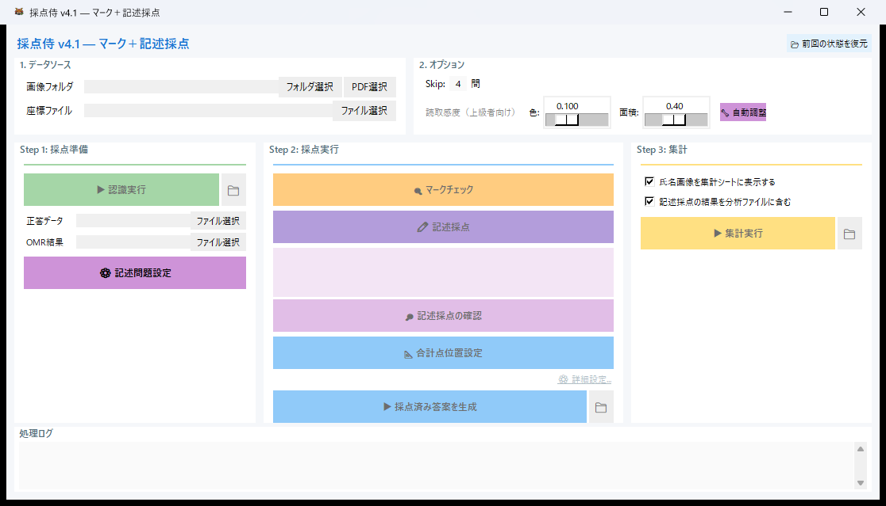
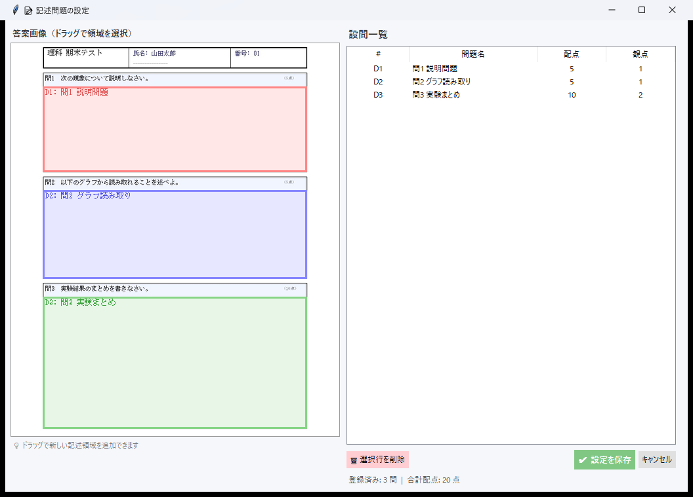
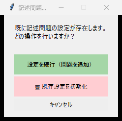
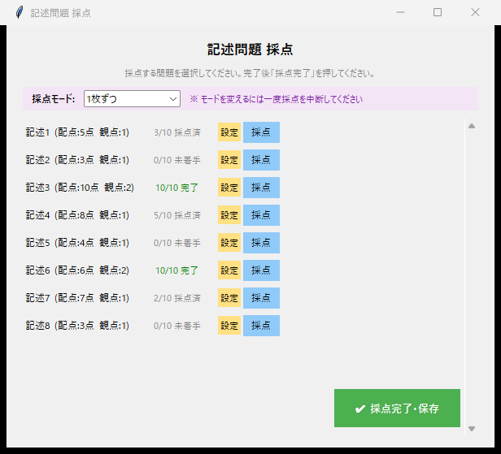
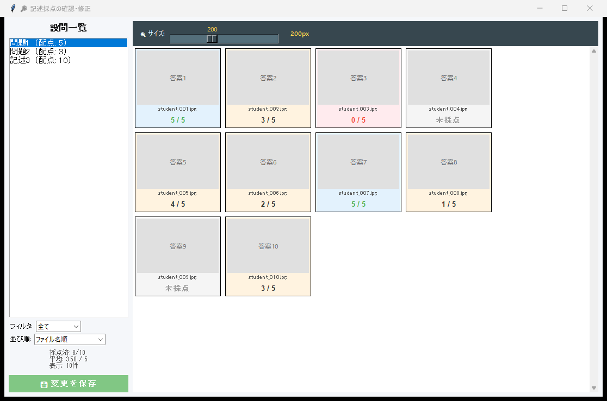
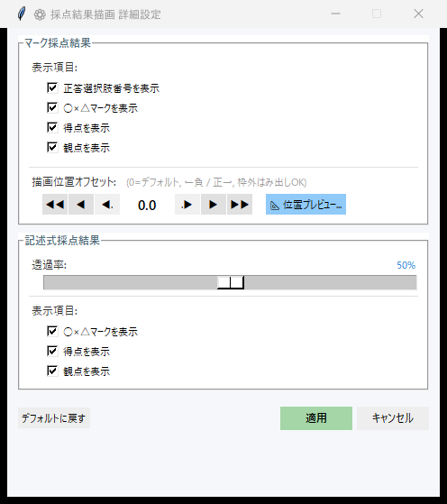

# マーク＋記述の使い方

マーク式と記述式が混在する試験を、1つのワークフローで採点するモードです。

---

## ワークフロー概要

```
座標ファイル読込 → スキャン画像読込 → OMR認識 → マークチェック
  → 記述式の領域設定 → 記述式の採点 → 統合して結果出力
```

マーク部分はマーク採点モードと同じ自動認識、記述部分は手動採点で処理し、最後に合算して結果を出力します。

---

## 1. ファイルの準備

マーク＋記述モードで事前に用意するファイルは **2 つ** です。

| ファイル | 説明 |
|---|---|
| **Mark2 座標ファイル** | Mark2 テンプレートサイトからダウンロードした座標 Excel |
| **スキャン画像** | 答案をスキャンした JPEG / PNG / PDF |

マーク問題の正答・配点は、OMR 読み取り後に自動生成される `answer_key.xlsx` に記入します。詳しくは [マーク採点の使い方](mark.md) をご覧ください。

---

## 2. メイン画面

モード選択で **「マーク＋記述」** を選ぶと、混合モードのメイン画面が開きます。
マーク採点のステップに加え、記述式の設定ステップが追加されています。

{ .screenshot }
<span class="caption">マーク＋記述モードのメイン画面</span>

---

## 3. マーク部分の処理

マーク部分の処理は、[マーク採点モード](mark.md) と同じです。

1. **座標ファイル・スキャン画像の読み込み**
2. **OMR（光学マーク認識）による自動読み取り**
3. **閾値キャリブレーション**（必要に応じて）
4. **マークチェック**（未マーク・ダブルマークの確認と修正）

---

## 4. 記述式の領域設定

マーク部分の処理が完了したら、記述式の領域を追加で設定します。

統合セットアップ画面で、**設問ごとに** 解答エリアをマウスドラッグで指定します。左に答案画像、右に設問テーブルが表示され、領域の追加と問題情報の編集を 1 画面で行えます。

{ .screenshot }
<span class="caption">記述式の統合セットアップ画面 — ドラッグで領域追加、テーブルで配点を一括編集</span>

セットアップ時のアクション選択では、領域の追加・変更が可能です。

{ .screenshot-small }
<span class="caption">記述式セットアップのアクション選択</span>

---

## 5. 記述式の採点

記述式領域の設定が完了したら、[記述式採点モード](descriptive.md) と同じ方法で手動採点を行います。

- **1枚ずつ表示**: ○×ボタンやキーボード入力で 1 人ずつ採点
- **グリッド一覧**: 全生徒の解答を一覧で確認しながら素早く採点

{ .screenshot }
<span class="caption">記述式問題の一覧画面</span>

採点レビュー画面で、記述式の採点結果を確認できます。

{ .screenshot }
<span class="caption">記述式の採点レビュー画面</span>

---

## 6. 描画設定

マーク＋記述モードの描画設定では、マーク部分と記述部分の両方の表示スタイルを設定できます。  
マーク部分の設定項目は [マーク採点の描画設定](mark.md) と同じです。

記述式の追加設定として、以下が使えます。

| 設定 | 内容 |
|---|---|
| **透過率** | 記述領域に描画するマーク・得点の透明度（0〜100%） |
| **○×△マークを表示** | 満点=○、部分点=△、0点=×を記述領域に透過描画 |
| **得点を表示** | 得点を記述領域に透過描画 |
| **観点を表示** | 観点番号（丸数字）を記述領域に透過描画 |

{ .screenshot }
<span class="caption">マーク＋記述モードの描画設定</span>

---

## 7. 結果の出力

マーク部分と記述部分の点数が合算され、統合結果として出力されます。

| 出力先 | 内容 |
|---|---|
| `01_Results/` | OMR データ、正答ファイル、座標データ |
| `02_Graded_Detail/` | 採点済み答案画像（○×マーク・得点すべて描画） |
| `03_Final_Report/` | 生徒別成績サマリー Excel、試験統計 Excel、CTT 分析 PDF、統合 PDF、R 分析キット |

!!! info "セッション保存の活用"
    混合モードでは作業量が多くなるため、**セッション保存** を活用して作業を分割することをおすすめします。作業途中の状態を保存し、後から再開できます。
