# 記述式採点の使い方

スキャン画像から採点領域を指定し、記述式の答案を効率的に採点するモードです。

---

## ワークフロー概要

```
スキャン画像読込 → 採点領域の設定 → 問題ごとに採点 → 結果出力
```

---

## 1. スキャン画像の準備

記述式採点モードでは、Mark2 座標ファイルは不要です。必要なのはスキャン画像のみです。

| 必要なもの | 説明 |
|---|---|
| **スキャン画像** | 答案をスキャンした JPEG / PNG / PDF |

!!! tip "スキャン時のポイント"
    - 解像度は **200〜300 dpi** がおすすめです
    - コーナーマーカーがある場合は、傾き補正が自動で行われます
    - 普通のコピー機の「スキャン → フォルダ保存」機能で十分です

---

## 2. メイン画面

モード選択で **「記述式採点」** を選ぶと、記述式専用のメイン画面が開きます。

{ .screenshot }
<span class="caption">記述式採点モードのメイン画面</span>

---

## 3. 採点領域の設定

答案画像上で、各問題の採点領域をマウスドラッグで指定します。

問題の数だけ領域を設定します。追加の領域が必要かどうかを、ダイアログで確認されます。

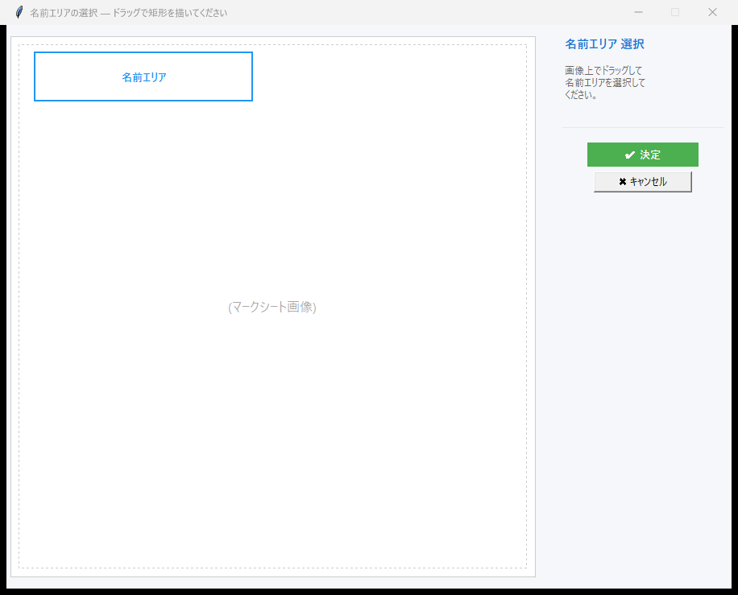{ .screenshot }
<span class="caption">マウスドラッグで採点領域を指定</span>

問題情報（配点、採点方式）を設定するダイアログが表示されます。

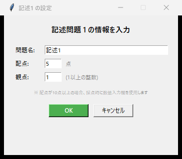{ .screenshot-small }
<span class="caption">問題情報の設定ダイアログ</span>

追加の問題がある場合は、続けて設定します。

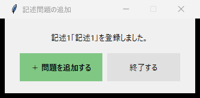{ .screenshot-small }
<span class="caption">問題の追加確認</span>

---

## 4. 採点方法

記述式採点には **2 つの表示モード** があります。

### 1枚ずつ採点モード

1 人の答案を 1 枚ずつ表示し、拡大画像を見ながら採点します。
○（正解）・×（不正解）・△（部分点）ボタンで判定します。

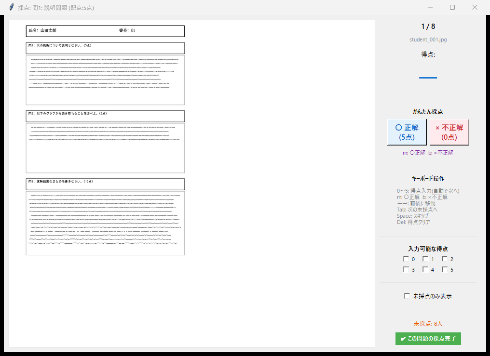{ .screenshot }
<span class="caption">1枚ずつの採点画面 — ○×△ボタンで判定</span>

採点結果は即座にフィードバック表示されます。

=== "○（正解）"

    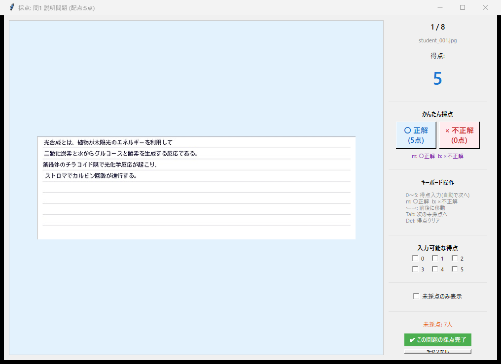{ .screenshot }
    <span class="caption">○判定：背景が緑に変化</span>

=== "×（不正解）"

    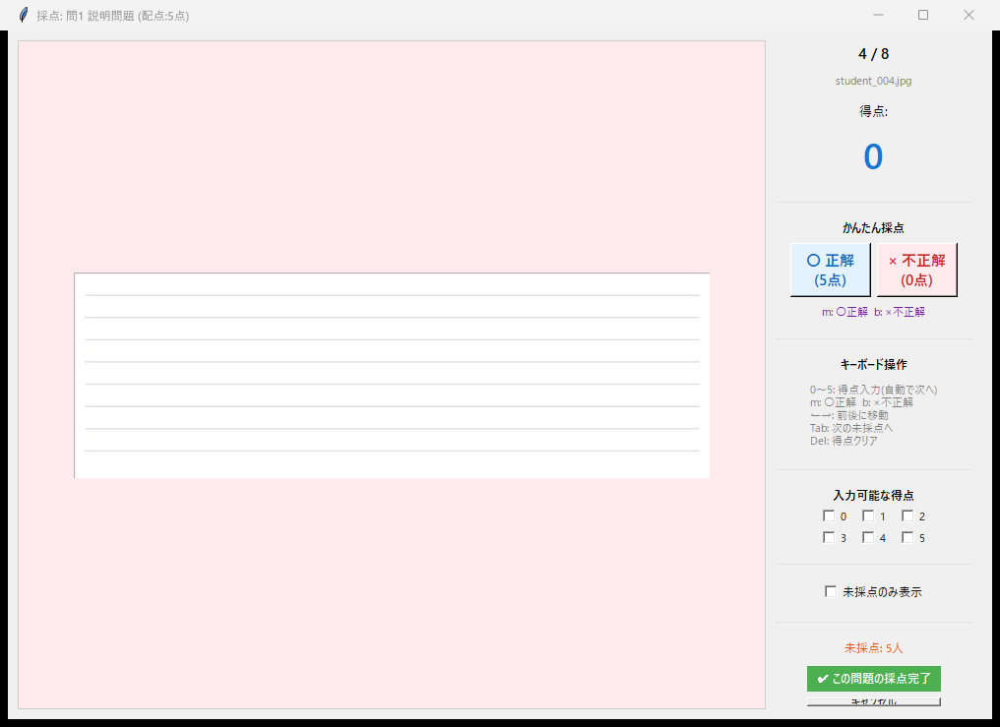{ .screenshot }
    <span class="caption">×判定：背景が赤に変化</span>

=== "△（部分点）"

    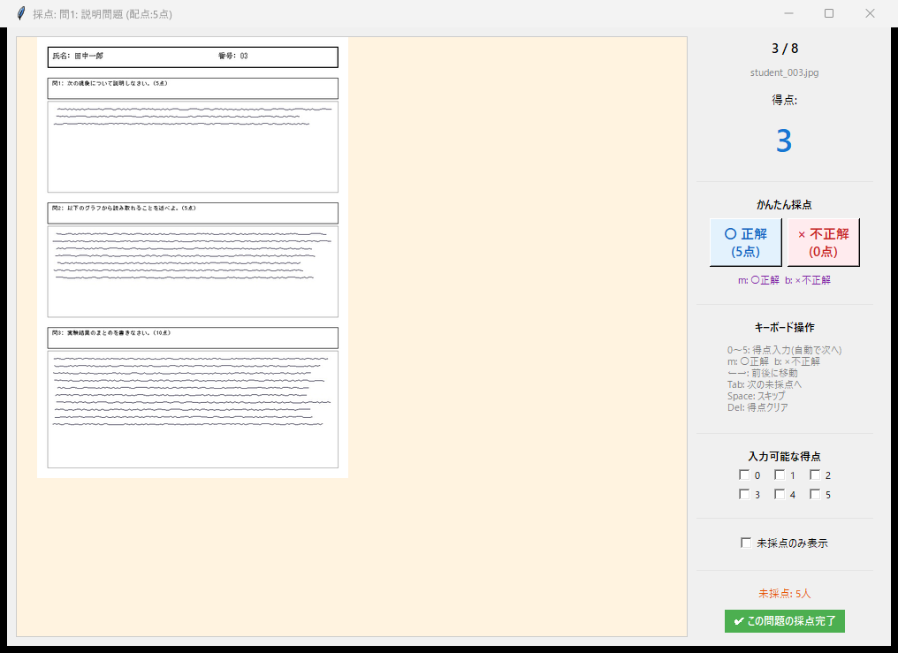{ .screenshot }
    <span class="caption">△判定：部分点を入力</span>

### グリッド一覧モード

全生徒の同じ問題を一覧グリッドで表示し、素早く採点できます。
大量の答案を効率的に処理したいときに便利です。

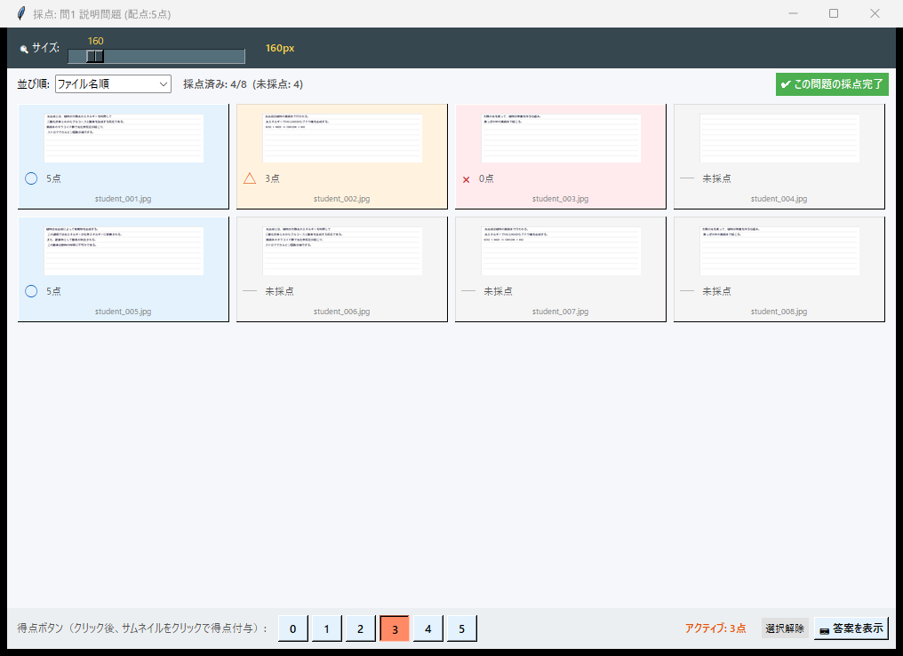{ .screenshot-wide }
<span class="caption">グリッド一覧モード — 全生徒の解答を一覧表示</span>

---

## 5. 未採点フィルタ

採点漏れを防ぐために、未採点の答案だけを表示するフィルタ機能があります。

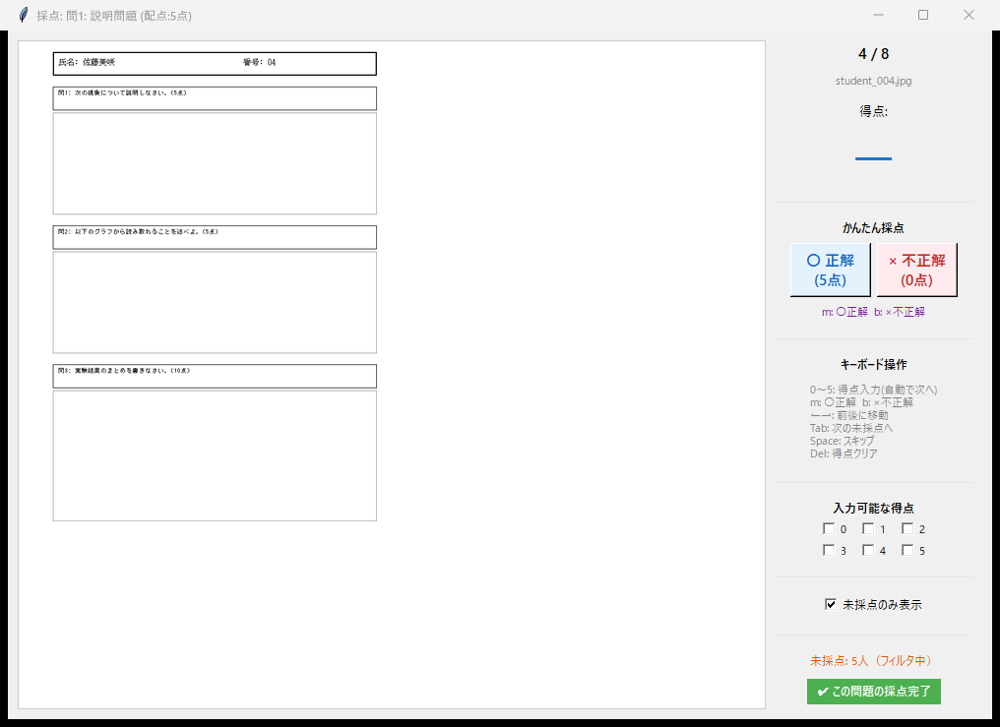{ .screenshot }
<span class="caption">未採点フィルタを有効にした状態</span>

すべての採点が完了すると表示が切り替わります。

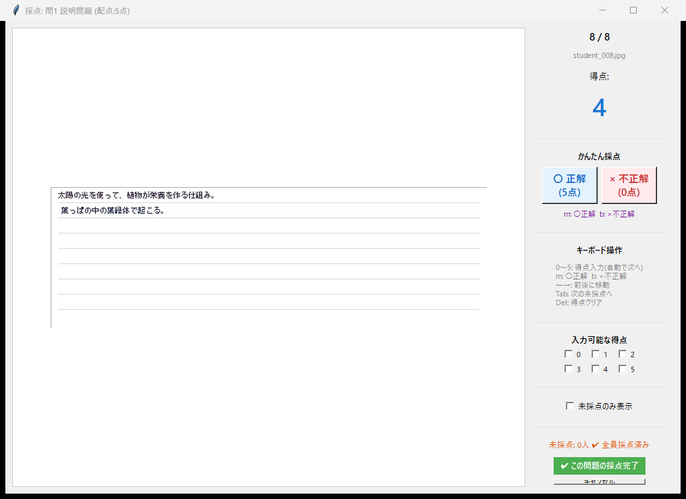{ .screenshot }
<span class="caption">すべての採点が完了した状態</span>

---

## 6. 描画設定

記述式採点用の描画設定では、○×△マークの表示や得点テキストのスタイルをカスタマイズできます。

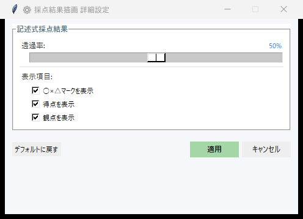{ .screenshot }
<span class="caption">記述式採点の描画設定</span>

---

## 7. 結果の出力

採点が完了すると、以下のファイルが `_saiten_grading_results/` フォルダに自動生成されます。

| 出力先 | 内容 |
|---|---|
| `01_Results/` | 生徒別成績サマリー Excel |
| `02_Graded_Detail/` | 採点済み答案画像（○×△マーク・得点付き） |
| `03_Final_Report/` | 試験統計 Excel |
