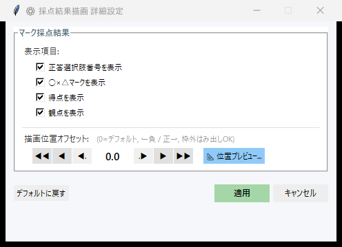
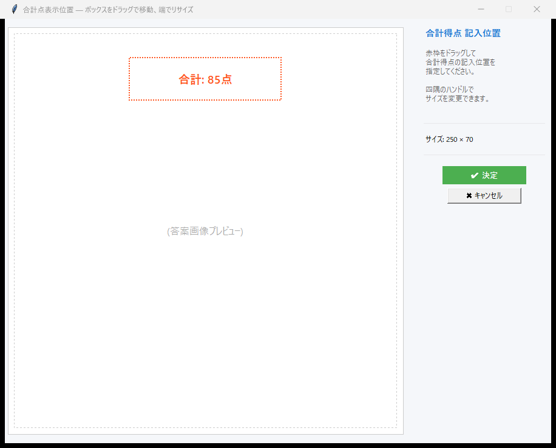
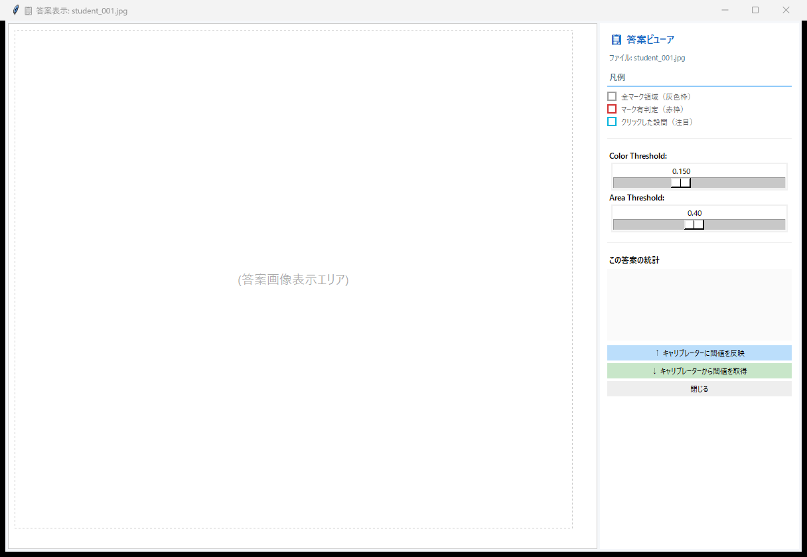

# マーク採点の使い方

Mark2 形式のマークシートを自動で読み取り、採点するモードです。  
このページでは、スキャン画像の読み込みから結果出力までの全手順を、初めて使う方にもわかるように説明します。

---

## ワークフロー概要

```
座標ファイル読込 → スキャン画像読込 → OMR認識 → 正答登録 → マークチェック → 採点 → 結果出力
```

---

## 1. ファイルの準備

マーク採点で事前に用意するファイルは **2 つ** です。

| ファイル | 説明 |
|---|---|
| **Mark2 座標ファイル** | [Mark2 テンプレートサイト](https://mark2.sfc.keio.ac.jp/ja/templates) からダウンロードした座標 Excel（`.xlsx`）形式 |
| **スキャン画像** | 答案をスキャンした画像（JPEG / PNG / PDF 形式）。**1 枚の画像 = 1 人分の答案** です |

!!! question "マーク問題の答えや配点はどうやって登録するの？"
    事前にファイルを準備する必要はありません。  
    OMR 読み取りを実行すると、スキャン画像フォルダの中に正答データファイル（`answer_key.xlsx`）が自動生成されます。  
    正確なパスは以下の通りです:

    ```
    スキャン画像フォルダ/
    └── _saiten_grading_results/
        └── 01_Results/
            └── results_data/
                └── answer_key.xlsx  ← ★ このファイルをExcelで開いて編集
    ```

    このファイルを Excel で開いて、以下の 3 項目を記入してください。

    | 列名 | 内容 |
    |---|---|
    | **正答** | 正しい選択肢の番号 |
    | **配点** | その問題の配点 |
    | **観点** | 観点別集計のためのグループ番号 |

    観点別の集計が不要であれば、**観点はすべて `1`** で構いません。  
    記入が終わったら保存して、採点を実行してください。

    :material-arrow-right: 実際の問題数よりマーク欄が多い場合は [こちらの FAQ](../faq.md#excess-mark-areas) をご覧ください。

---

## 2. メイン画面の操作

モード選択で **「マーク採点」** を選ぶと、マーク採点専用のメイン画面が開きます。  
画面上のボタンを **上から順に** 操作してください。

1. **「フォルダ選択」** ボタンを押して、スキャン画像が保存されているフォルダを選択します  
   （PDF ファイルを読み込む場合は **「PDF 選択」** ボタンを使ってください。採点侍が自動で画像に変換します）
2. **「ファイル選択」** ボタンを押して、Mark2 テンプレートの座標ファイル（Excel）を選択します
3. **Skip 数** を確認します。これは解答欄の前にある「学年」「クラス」「番号」「氏名」等の欄の数です。多くの Mark2 テンプレートでは **`4`** のままで OK です
4. **「▶ 認識実行」** ボタンを押すと、マーク読み取り（OMR）が開始されます

認識が完了すると、スキャン画像フォルダの中に `_saiten_grading_results/` フォルダが自動生成され、`answer_key.xlsx` が作成されます。

初回実行時は、処理完了と同時に正答入力の案内ダイアログが表示されます。「📂 フォルダを開いて編集する」を押すと、`answer_key.xlsx` のあるフォルダが開き、正答データのパスも自動設定されます。

??? info "ダイアログの詳細"
    - **「📂 フォルダを開いて編集する」**: フォルダを開き、正答データのパスを自動設定します
    - **「後で入力する」**: ダイアログを閉じます。正答データのパスは自動設定されません（手動で設定してください）
    - 正答が既に入力済みの場合（閾値変更後の再実行など）は、この案内ダイアログは表示されません

保存したら、メイン画面の「正答データ」の **「ファイル選択」** ボタンを押して `answer_key.xlsx` を選択してください。

{ .screenshot }
<span class="caption">マーク採点モードのメイン画面</span>

!!! tip "前回の作業が見つかると自動で提案されます"
    以前に同じフォルダで作業していた場合、フォルダ選択時に **「前回の設定を復元しますか？」** というダイアログが自動表示されます。  
    「はい」を選ぶと、座標ファイル・正答データ・閾値設定などが前回の状態に復元されます。
### 認識方式の選択（v4.5 新機能）

メイン画面には **「認識方式」** コンボボックスが表示され、 マーク判定アルゴリズムを選択できます。

| 選択肢 | 説明 |
|---|---|
| **（推奨）クラスタリング** | K-means法による 7 次元特徴量で判定。溈しゴム跡にも強い。**デフォルト設定。** |
| **しきい値による識別（従来式）** | v4.4 以前のコンパクトな指定間隔識別。 スライダーで手動調整が必要な場合に使用。 |

!!! info "クラスタリング模ード選択時"
    **クラスタリング** を選ぶと、スライダー円の指定は不要となり画面から非表示になります。
    内部で K-means が自動的に分離境界を決定するため、手動調整は不要です。

    **しきい値** を選ぶと、従来の「色の読取感度」「面積の読取感度」スライダーが表示され、すべてのマークに共通の固定境界値を手動で指定できます。
---

## 3. マーク読み取り精度の設定（しきい値モード時のみ）

認識方式で **しきい値による識別（従来式）** を選んだ場合は、マーク認識の精度を調整する画面を利用できます。  
「クラスタリング（推奨）」を選んでいる場合、この画面はスキップされます。  
特にこだわりがなければ、**「▶ 自動計算 実行」** ボタンをクリックするだけで OK です。  
自動計算の後、プレビュー画面でマークの認識がおおむね正しいことを確認してください。

うまくいっていない箇所がある場合は、「色の読取感度」「面積の読取感度」のスライダーを手動で微調整し、「🔄 この閾値で再判定」で結果を確認します。

{ .screenshot }
<span class="caption">マーク読み取り精度の設定画面</span>

??? abstract "マーク認識の仕組みについて詳しく知りたい方へ"

    !!! info "2 つの感度スライダーの意味"
        マーク認識は 2 段階で動作します。

        **① 色の読取感度**（範囲: 0.03〜0.35）

        スキャン画像をグレースケールに変換し、どの明るさから「黒」と見なすかの境界を設定します。値が大きいほど、薄い鉛筆の跡もマークとして拾います。

        **② 面積の読取感度**（範囲: 0.05〜0.80）

        マーク欄の中で「黒」と判定された画素が占める割合がこの値を超えたとき、「マークされている」と判定します。例えば 0.40 なら、マーク欄の 40% 以上が塗られていれば有効なマークとみなします。

    !!! info "自動計算のアルゴリズム — 大津の方法と K-means"

        「▶ 自動計算 実行」を押すと、以下のアルゴリズムで最適な感度を推定します。

        **色の読取感度 → 大津の二値化法（Otsu's method）**

        読み込んだ全画像の全マーク領域から画素の明るさのヒストグラムを作成し、「塗られている画素」と「塗られていない画素」の 2 グループに分離します。両グループの分散が最大になる境界値を自動的に計算します。これはコンピュータビジョンの分野で広く使われている手法です。

        **面積の読取感度 → K-means 2 クラス分類**

        推定した色の閾値で全マーク領域の塗りつぶし率を計測し、K-means クラスタリングで「塗りつぶし率が高いグループ（マークあり）」と「低いグループ（マークなし）」の 2 つに分類します。その 2 グループの境界値を推奨の感度として算出します。

---

## 4. マークチェック

OMR の認識結果をもとに、以下のエラーを自動検出します。

| エラー種別 | 内容 |
|---|---|
| **未マーク** | どの選択肢もマークされていない |
| **複数マーク** | 複数の選択肢がマークされている |
| **不正値** | 読み取り結果が有効な選択肢番号（1桁の数字）でない |

エラーがある場合は、マークチェック画面が開き、1 件ずつ確認しながら修正できます。

### 画面の見方

画面上部にはエラーの進捗（要チェック数・チェック済み数・進捗率）が表示されます。  
中央にマークシート画像のエラー箇所が拡大表示され、下部に読み取り結果と修正用のコントロールが並びます。

正答データ（`answer_key.xlsx`）が設定されている場合、正答の選択肢位置に **赤色の点線枠** が自動的に表示されます。  
この枠は「どの選択肢が正しいか」を一目で確認でき、未マーク・ダブルマークの修正判断がスムーズになります。

{ .screenshot }
<span class="caption">マークチェック画面 — エラーの確認と修正（正答枠は赤い点線で表示）</span>

??? tip "正答枠が表示されない場合"
    正答枠は `answer_key.xlsx` の「正答」列に値が入力されている問題でのみ表示されます。  
    正答枠が表示されない場合は、以下を確認してください：

    - メイン画面で「正答データ」のファイルパスが設定されているか
    - `answer_key.xlsx` の「正答」列に正しい選択肢番号が入力されているか

### 修正の操作

**選択肢ボタン**（`1` 〜 `10`）をクリックすると、その選択肢に修正して自動的に次のエラーへ進みます。キーボードの数字キーでも同様に操作できます（`0` キーは選択肢 `10` に対応）。

**`-1` ボタン**（赤色）は「無効回答」を意味します。生徒が意図的にマークしていないと判断した場合や、読み取り不能な場合にこのボタンを押してください。`-1` に設定した問題は採点対象から除外されます。

テキスト入力欄に直接値を入力して `Enter` キーで確定することもできます。

### ナビゲーション

| ボタン | 動作 |
|---|---|
| **← 前へ** | 1 つ前のエラーに戻る |
| **保存して次へ →** | 入力欄の値を保存して次のエラーへ進む |
| **SKIP** | このエラーを後回しにして次へ進む（後から再チェック可能） |

### チェック結果の反映

すべてのエラーをチェックし終えたら（または途中でも）、画面下部の **「チェック結果を xlsx に反映」** ボタンを押してください。修正内容が OMR 結果の Excel ファイルに書き込まれます。反映前に自動でバックアップが作成されるのでご安心ください。

---

## 5. 描画設定

採点結果を答案画像に描画する際の設定をカスタマイズできます。  
メイン画面の **「⚙ 詳細設定...」** リンクから設定ダイアログを開きます。

{ .screenshot }
<span class="caption">マーク採点モードの描画設定</span>

### 表示項目

答案画像に描画する情報をチェックボックスで選べます。

| チェックボックス | 内容 |
|---|---|
| **正答選択肢番号を表示** | 不正解の問題について、正答の選択肢位置に正答番号を赤字で描画します |
| **○×△マークを表示** | 正解なら○、不正解なら×を赤字で描画します |
| **得点を表示** | 各問の得点を○×の右隣に黒字で描画します |
| **観点を表示** | 観点番号を丸数字（①②③…）で得点の右隣に描画します |

### 描画位置オフセット

○×マークや得点テキストをマーク欄のどの位置に描画するかを調整します。デフォルト（`0.0`）では、マーク欄の右端付近に描画されます。

- **正の値** → **右**方向にずらす
- **負の値** → **左**方向にずらす
- マーク枠の外側にはみ出しても問題ありません

矢印ボタンで値を増減できます。

| ボタン | 増分 | 用途 |
|---|---|---|
| **◀◀** / **▶▶** | ±1.0（マーク欄 1 つ分） | 大きく移動 |
| **◀** / **▶** | ±0.5（半マーク分） | 中程度の移動 |
| **◀.** / **.▶** | ±0.1 | 微調整 |

**「📐 位置プレビュー...」** ボタンを押すと、実際の答案画像上で描画位置をリアルタイムに確認しながら調整できます。プレビュー画面では赤枠が○×マークの位置、青枠が得点・観点の位置を示します。

### その他のボタン

| ボタン | 動作 |
|---|---|
| **デフォルトに戻す** | すべての設定を初期値にリセットします |
| **適用** | 設定を保存してダイアログを閉じます |
| **キャンセル** | 変更を破棄してダイアログを閉じます |

---

## 6. 合計点の表示位置

合計点を答案画像のどこに描画するかを指定できます。

{ .screenshot }
<span class="caption">合計点の表示位置を選択</span>

---

## 7. 結果の出力

採点が完了すると、以下のファイルが **スキャン画像フォルダの中** の `_saiten_grading_results/` フォルダに自動生成されます。

```
あなたのスキャン画像フォルダ/
├── 生徒01.jpg, 生徒02.jpg, …
└── _saiten_grading_results/
    ├── 00_Processing/             ← 枠描画済み画像（中間ファイル）
    ├── 00_Processing_Clean/       ← 補正済み画像（枠なし、記述採点プレビュー用）
    ├── 01_Results/                ← OMR データ・正答ファイル
    │   └── answer_key.xlsx       ← 正答データ
    ├── 02_Graded_Detail/          ← 採点済み答案画像（○×マーク・得点付き）
    └── 03_Final_Report/           ← 成績サマリー・統計レポート・CTT分析
```

| 出力先 | 主なファイル |
|---|---|
| `01_Results/` | OMR 読み取り結果 Excel、正答ファイル |
| `02_Graded_Detail/` | 採点済み答案画像（○×マーク・得点が描画された画像） |
| `03_Final_Report/` | 生徒別成績サマリー Excel、試験統計 Excel、CTT 分析 PDF |

---

## 8. 生徒ビューア

個別の生徒の採点結果を確認するビューアも搭載しています。

{ .screenshot }
<span class="caption">生徒別の採点結果ビューア</span>
