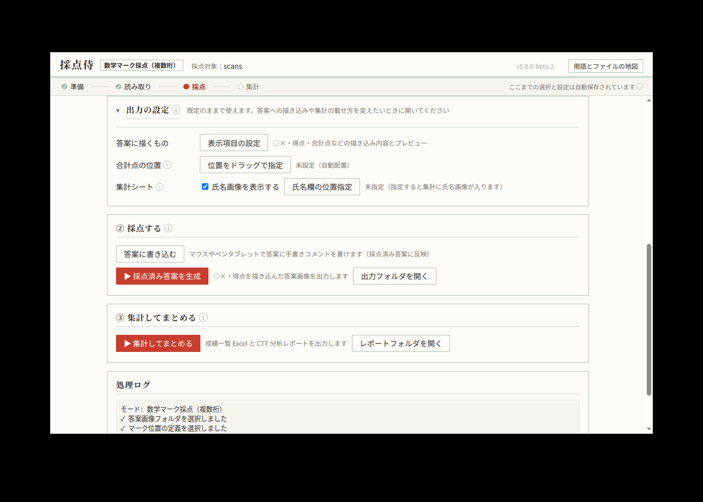

# マーク採点の使い方

Mark2 形式のマークシートを自動で読み取り、採点するモードです。
このページでは、スキャン画像の読み込みから結果出力までの全手順を、初めて使う方にもわかるように説明します。

このページは **新UI（v5 系ベータ）** の画面で説明します。
従来UI（v4 系）をお使いの場合は、各所の「従来UI」タブをご覧ください。

---

## ワークフロー概要

```
マーク位置の定義を選ぶ → 答案画像を選ぶ → ① 答案を読み取る → 正答・配点を入力
→ マークを確認する → ② 採点済み答案を生成 → ③ 集計してまとめる
```

画面上部の**進行バー（準備 → 読み取り → 採点 → 集計）**が、いまどこまで進んだかを常に示します。
選んだファイルや設定は**操作のたびに自動保存**されます。

---

## 1. ファイルの準備

マーク採点で事前に用意するファイルは **2 つ** です。

| ファイル | 説明 |
|---|---|
| **マーク位置の定義** | [Mark2 テンプレートサイト](https://mark2.sfc.keio.ac.jp/ja/templates) からダウンロードした座標 Excel（`.xlsx`）ファイル（いわゆる「座標ファイル」） |
| **スキャン画像** | 答案をスキャンした画像（JPEG / PNG / PDF 形式）。**1 枚の画像 = 1 人分の答案** です |

!!! question "マーク問題の答えや配点はどうやって登録するの？"
    事前にファイルを準備する必要はありません。
    「▶ 答案を読み取る」を実行すると、結果フォルダに正答データファイル（`answer_key.xlsx`）が自動生成されます。

    ```
    答案画像フォルダ/
    └── _saiten_grading_results/
        └── 01_Results/
            └── answer_key.xlsx  ← ★ このファイルをExcelで開いて編集
    ```

    このファイルを Excel で開いて、以下の 3 項目を記入してください。

    | 列名 | 内容 |
    |---|---|
    | **正答** | 正しい選択肢の番号 |
    | **配点** | その問題の配点 |
    | **観点** | 観点別集計のためのグループ番号 |

    観点別の集計が不要であれば、**観点はすべて `1`** で構いません。
    記入が終わったら保存して、メイン画面の「再チェック」を押してください。

    :material-arrow-right: 実際の問題数よりマーク欄が多い場合は [こちらの FAQ](../faq.md#excess-mark-areas) をご覧ください。

---

## 2. メイン画面の操作

モード選択で **「マーク採点のみ」**（または「マーク採点 ＋ 記述採点」）を選ぶと、メイン画面が開きます。
**データソース**の欄を上から順に埋めてください。

{ .screenshot }
<span class="caption">マーク採点モードのメイン画面（新UI）。上部の進行バーが現在地を示します</span>

1. **答案画像フォルダ**の「フォルダ選択」で、スキャン画像のフォルダを選択します
   （PDF の場合は「PDF選択」— 採点侍が自動で画像に展開します。進捗も表示されます）
2. **マーク位置の定義**の「ファイル選択」で、Mark2 の座標 Excel を選択します
   — 選んだ瞬間に行数・マーク数がチェックされ、下に要約が表示されます。
   選んだモードと合わないファイルには ⚠ の警告が出ます
3. **ID欄の列数**を確認します。解答欄の前にある「学年」「クラス」「番号」「氏名」等の、
   採点しない欄の数です。多くの Mark2 テンプレートでは **`4`** のままで OK です

!!! tip "各項目の ℹ を押すと説明が出ます"
    「このファイルは何？」と迷ったら、項目名の横の **ℹ** にマウスを載せてください。
    さらに詳しくは、右上の **「用語とファイルの地図」** にフォルダ・ファイルの一覧があります。

!!! tip "前回の作業が見つかると自動で提案されます"
    以前に同じフォルダで作業していた場合、フォルダ選択時に「前回の続きから再開しますか？」と
    確認されます。「はい」を選ぶと、マーク位置の定義・正答・配点・読み取り方式などが前回の状態に復元されます。
    モード選択画面の「前回の採点を再開する」からも再開できます。

=== "従来UI"

    従来UI（v4 系）でも項目は同じですが、名前が一部異なります:
    「座標ファイル」（=マーク位置の定義）、「Skip」（=ID欄の列数）、「正答データ」（=正答・配点）。
    採点データは両UIで共通なので、途中でどちらへ移っても続きから採点できます。

---

## 3. 読み取り方式の選択

「① 答案を読み取る」パネルの **「読み取り方式」** で、マーク判定アルゴリズムを選べます。

| 選択肢 | 説明 |
|---|---|
| **（推奨）クラスタリング** | K-means 法による 7 次元特徴量で判定。消しゴム跡にも強い。**デフォルト設定。** |
| **しきい値による識別（従来式）** | すべてのマークに共通の固定境界値で判定。手動で境界を指定したい場合に使用。 |

**クラスタリング**を選んだ場合、しきい値の入力欄は表示されません。
内部で K-means が自動的に分離境界を決定するため、手動調整は不要です。

**しきい値による識別（従来式）**を選ぶと、**「濃さ」「面積」の数値入力欄**と
**「自動調整」ボタン**が表示されます。

- **濃さ** — どの暗さから「黒」と見なすかの境界。値が大きいほど、薄い鉛筆の跡もマークとして拾います
- **面積** — マーク欄の中で「黒」の画素が占める割合がこの値を超えたとき「マークあり」と判定します
- **「自動調整」** — サンプル画像からしきい値を推定して、2 つの欄に自動で適用します

自動調整のあと「▶ 答案を読み取る」を実行し、後述の**マークの確認**で
結果がおおむね正しいことを確かめてください（白さ順の並びで、怪しいマークが先頭に集まります）。

??? abstract "自動調整のアルゴリズム — 大津の方法と K-means"

    **濃さ → 大津の二値化法（Otsu's method）**

    サンプル画像のマーク領域から画素の明るさのヒストグラムを作成し、「塗られている画素」と
    「塗られていない画素」の 2 グループに分離します。両グループの分散が最大になる境界値を
    自動的に計算する、コンピュータビジョンの分野で広く使われている手法です。

    **面積 → K-means 2 クラス分類**

    推定した濃さの境界で各マーク欄の塗りつぶし率を計測し、K-means クラスタリングで
    「塗りつぶし率が高いグループ（マークあり）」と「低いグループ（マークなし）」に分類して、
    その境界値を推奨値として算出します。

=== "従来UI"

    従来UIでは「色の読取感度」「面積の読取感度」の**スライダー**で調整し、
    「🔧 自動調整」を押すと専用の**キャリブレーション画面**（全マークのギャラリー表示・
    「🔄 この閾値で再判定」・答案ビューア）が開きます。
    このキャリブレーション画面は新UIにはありません。新UIでは「自動調整」で推定値を即適用し、
    確認は「マークを確認する」の白さ順一覧で行います。

---

## 4. 答案を読み取る（①）

**「▶ 答案を読み取る」** を押すと、全答案の傾きを補正し、マークを読み取ります。

- 進捗はバーと処理ログに表示され、**「⏹ 中断」** でいつでも止められます
- 完了すると **読み取り結果**（`Mark2-Result-….xlsx`）が自動で設定されます
- 補正後の画像は「補正画像フォルダを開く」で確認できます

読み取りが終わったら、**正答・配点**を入力します:

1. 結果フォルダの `01_Results/answer_key.xlsx` を Excel で開いて、
   各問題の**正答・配点・観点**を入力し、保存します
2. メイン画面の**正答・配点**の「ファイル選択」で選びます（同じ場所にあれば
   フォルダ選択時に自動検出されます）— 選んだ瞬間に内容がチェックされ、
   問題があればその場で表示されます。Excel を修正したら **「再チェック」** を押してください

=== "従来UI"

    従来UIのボタン名は「▶ 認識実行」です。初回実行後に正答入力の案内ダイアログ
    （「📂 フォルダを開いて編集する」）が表示されます。新UIではダイアログの代わりに、
    処理ログの完了メッセージと、正答・配点の検証結果の常時表示で案内します。

---

## 5. マークを確認する

**「マークを確認する」** を押すと、読み取り結果の確認・訂正画面が開きます。
無記入・二重マークなどの「要確認」なマークが自動で集められ、カードの一覧で確認できます。

{ .screenshot }
<span class="caption">マークの確認 — 要確認のマークをカード一覧で訂正</span>

自動検出されるのは、次の 3 種類です。

| 種別 | 内容 |
|---|---|
| **ノーマーク** | どの選択肢もマークされていない |
| **複数マーク** | 複数の選択肢がマークされている |
| **不正値** | 読み取り結果が有効な選択肢番号でない |

### 画面の見方

- 画面上部に **全体の件数・要確認の件数・訂正済みの件数** が常に表示されます
- **タブ**で表示を切り替えます: **「⚠ 要確認」**（エラーだけを集めたタブ）、
  **「すべて」**、そして **読み取った値ごとのタブ**（例: 「1」「2」…）。
  値ごとのタブでは「本当にその値でよいか」を横並びで見比べられます
- **並び順**は **「白さ順（白い順）」が既定**です。マークが薄い（=読み取りに自信がない）ものが
  先頭に来るので、上から順に見ていけば怪しいものを効率よく確認できます。
  「画像名順」に切り替えることもできます
- **カードの大きさ**は「小 / 中 / 大」から選べます
- 一覧は**仮想スクロール**なので、数百人 × 数千件でも 1 本のスクロールで軽快に動きます
- **画像をクリックすると拡大表示**されます

### 訂正の操作（キーボードで完結します）

画面のヒント行にも同じ説明が常時表示されています。

| 操作 | 動作 |
|---|---|
| **記号キー 1 打**（`0`〜`9`・`a`〜`d`・`-`） | いま選択中のカードをその値に**訂正して、次のカードへ進む** |
| **`←` `→` `↑` `↓`** | カードの選択を移動 |
| **`BackSpace`** | 訂正を取り消す |
| **`Enter`** | カードの入力欄にフォーカス（`-1` などの特殊値はここに入力して確定） |
| **画像クリック** | 拡大表示 |

`-1` は「無効回答」を意味します。生徒が意図的にマークしていないと判断した場合や、
読み取り不能な場合に使ってください。`-1` の問題は採点対象から除外されます。

### 一括操作

「ノーマーク」タブを開いているときだけ、**「ノーマーク全件を無効回答(-1)にする」** ボタンが
表示されます。未訂正のノーマークをまとめて `-1` にできます（実行前に確認があります）。

### 訂正の反映

訂正がたまったら、画面右上の **「訂正をxlsxに反映」** を押してください。
訂正内容が読み取り結果の Excel に書き込まれます。**反映前に自動でバックアップが作成される**ので、
安心して実行してください。

未反映の訂正が残ったまま「閉じる」を押すと確認が表示されます。訂正の下書きは
保存済みなので、次回開いたときに続きから反映できます。

=== "従来UI"

    従来UI（🔍 マークチェック）は、グリッド表示と 1 件ずつの単体表示を切り替える方式で、
    選択肢ボタン（1〜10・-1）や「保存して次へ →」「SKIP」ボタン、正答位置の赤い点線枠、
    「薄い解答 / 濃い解答」タブ、100 件ごとのページ切り替えがあります。
    新UIではこれらを「白さ順ソート＋記号キー 1 打＋仮想スクロール」に置き換えています。
    反映ボタンの名前は「チェック結果を xlsx に反映」です（動作は同じ・バックアップも同じ）。

---

## 6. 出力の設定

答案への描き込みや集計の載せ方を変えたいときは、メイン画面の **「出力の設定」** を
開いてください。**既定のままでも使えます。**

{ .screenshot }
<span class="caption">出力の設定 — 描き込み内容・合計点の位置・集計シートをここに集約</span>

| 項目 | 内容 |
|---|---|
| **答案に描くもの** | 「表示項目の設定」ボタンで、○×・得点・合計点などの描き込み内容を選びます（下記） |
| **合計点の位置** | 「位置をドラッグで指定」で、合計点を描く場所を答案画像上のドラッグで指定します。未設定なら自動配置です |
| **集計シート** | 「氏名画像を表示する」＋「氏名欄の位置指定」で、集計 Excel に氏名欄の切り抜き画像を貼れます |

### 表示項目の設定

「表示項目の設定」を押すとダイアログが開きます。
**変更はすぐに保存され、次の「採点済み答案を生成」から反映されます。**

{ .screenshot }
<span class="caption">表示項目の設定 — チェックを変えるとプレビューが即座に更新されます</span>

**合計点の表示**

| 項目 | 内容 |
|---|---|
| **満点も表示する** | オフにすると「得点：82 / 100」ではなく「得点：82」になります |
| **観点別の行を表示する** | 「(観点①：40/50 …)」の行を描くかどうか |

**マーク設問への描き込み**

| 項目 | 内容 |
|---|---|
| **○×△マーク** | 正解なら○、不正解なら×を描きます |
| **得点** | 各問の得点を描きます |
| **観点番号** | 観点番号を丸数字（①②③…）で描きます |
| **正答の選択肢番号** | 不正解の問題について、正答の選択肢位置に正答番号を描きます |
| **全員正解（特例）の設問に★** | 不適切問題などを正答データの特例列で「全員正解」にした設問に、救済の印として★を描きます |
| **文字の背景を白塗りする** | 描き込みが印字と重なって読みづらいときに |
| **描き込み位置のオフセット** | 0=標準。正の値で右へ、負の値で左へずらします（マーク欄のセル単位） |

オフセットは矢印ボタンのステッパーで増減します。

| ボタン | 増分 | 用途 |
|---|---|---|
| **◀◀** / **▶▶** | ±1.0（マーク欄 1 つ分） | 大きく移動 |
| **◀** / **▶** | ±0.5（半マーク分） | 中程度の移動 |
| **◀·** / **·▶** | ±0.1 | 微調整 |

ダイアログ下部の **プレビュー** には、**実際の描画関数の出力**が正解・不正解・★の例で
表示されます。チェックのオン/オフ・白塗り・オフセットの変更が即座に反映されるので、
生成し直さなくても仕上がりを確認できます。

**「既定に戻す」** で、すべての設定を初期値にリセットできます（実行前に確認があります）。

=== "従来UI"

    従来UIでは「⚙ 詳細設定...」リンクから同じ項目のダイアログを開き、「適用」で保存・
    「キャンセル」で破棄します（新UIは即保存で、キャンセルの代わりに「既定に戻す」）。
    位置の確認は「📐 位置プレビュー...」で、描画位置を赤枠・青枠の矩形で表示します。

---

## 7. 手書きコメントを書く（マークのみモードでも使えます）

「② 採点する」パネルの **「答案に書き込む」** を押すと、答案を 1 枚ずつ表示して、
マウスやペンタブレットで手書きコメントを書き込めます。書いたコメントは
**「▶ 採点済み答案を生成」** のときに採点済み答案へ反映されます。
元の答案画像には一切書き込みません。

:material-arrow-right: 操作の詳細は [一枚採点と手書きコメント](descriptive.md#一枚採点と手書きコメント) をご覧ください。

---

## 8. 結果の出力

**「▶ 採点済み答案を生成」**（②）と **「▶ 集計してまとめる」**（③）を実行すると、
**答案画像フォルダの中** の `_saiten_grading_results/` フォルダに結果が出力されます。

```
答案画像フォルダ/
├── 生徒01.jpg, 生徒02.jpg, …
└── _saiten_grading_results/          ← 採点結果フォルダ（自動作成）
    ├── 00_Processing/                ← 傾き補正済みの答案（作業用）
    ├── 01_Results/                   ← 読み取り結果・answer_key.xlsx・各種設定
    ├── 02_Graded_Detail/             ← 採点済み答案画像（返却用）
    └── 03_Final_Report/              ← 成績一覧 Excel・試験統計・CTT 分析（提出用）
```

各フォルダ・ファイルの意味と「消してよいか」は、画面右上の **「用語とファイルの地図」** と
**[フォルダとファイルの地図](../files-map.md)** にまとまっています。
